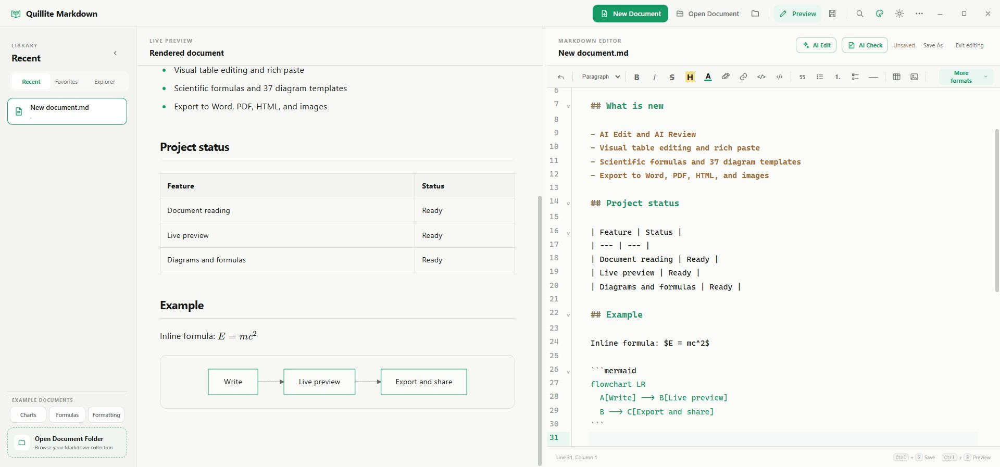
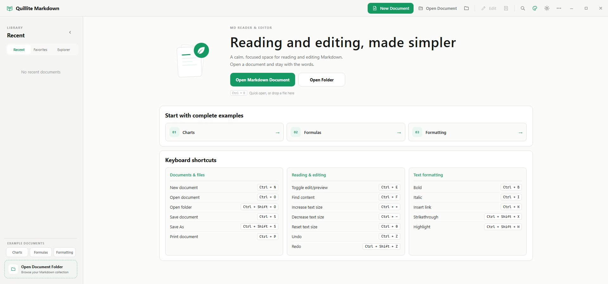
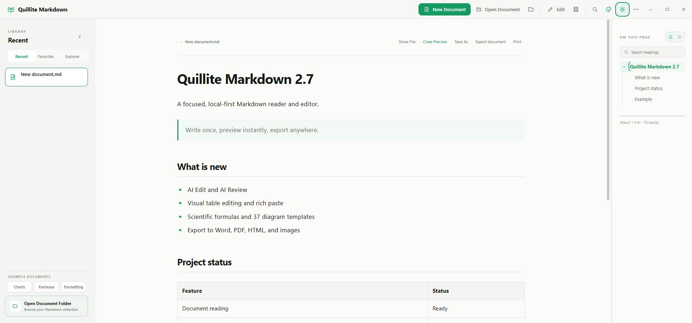

<div align="center">
  
  <h1>Quillite Markdown</h1>
  <p><strong>A fast, local-first Markdown reader, viewer and editor — about 12 MB on Windows.</strong></p>
  <p>Live preview · Syntax highlighting · Plain local files · Windows, macOS and Linux</p>
  <p><a href="README.md">简体中文</a> · <strong>English</strong></p>
  <p>
    <a href="https://github.com/liuhang798/quillite-markdown/actions/workflows/release.yml"></a>
    <a href="https://qm.ssssa.cn/#download"></a>
    <a href="LICENSE"></a>
    
  </p>
  <p>
    <a href="https://qm.ssssa.cn/"><strong>🌐 Official website: qm.ssssa.cn</strong></a>
    ·
    <a href="https://qm.ssssa.cn/#download"><strong>Download latest release</strong></a>
    · <a href="#screenshots">Screenshots</a>
    · <a href="#development">Build from source</a>
  </p>
</div>

AI settings use consistent cross-platform provider and model pickers in provider/endpoint, API key, then model order. Entering an endpoint and API key automatically discovers account models without requiring the key to be saved first; the draft key is used only for that request and is not written to preferences. Alibaba Cloud workspace endpoints are translated to their dedicated model-list API automatically. Connection diagnostics report endpoint, credential, model-list, and real model-request results separately. Successful model lists are cached for seven days and shown with a timestamp during temporary API failures. Before a DeepSeek key is saved, built-in candidates are shown without claiming account access. Custom OpenAI-compatible endpoints do not assume a default model: users choose a discovered model or enter the service's actual model ID. The reading view can generate a closable AI brief in place beneath the document actions, showing live progress before a one-sentence overview and three to five key points designed for a 5–10 second read; long documents are summarized by section and consolidated. The editor AI menu provides generate, edit, proofread, continue, translate, condense, expand, and custom workflows. Every workflow has a task-specific prompt; Continue and Expand optionally accept a target length, and Condense optionally accepts a retention ratio or target size. Leaving this field blank applies no limit. Translation supports the same 30 targets in both the interface and backend, each shown as its native label followed by a Chinese-language annotation. AI Edit streams generated text as it arrives and offers per-change acceptance or original-text retention before applying once; closing an active AI operation also cancels its network request.

On Windows, the startup window adapts to its monitor's available work area and DPI scaling so the title bar stays visible on smaller or mixed-DPI displays.

Saves and AI edits are scoped to their document session. Late results cannot change another document, and typing during a save keeps newer content marked unsaved. Saved copies of built-in examples become ordinary editable files.

Chart security checks distinguish raw data from executable options, preserving legitimate column names and dimension mappings. Large arrays are traversed incrementally to avoid argument-count errors.

Choose **More → Editor layout** to place the editor or preview on the left, or use the swap arrows in the live-preview header. Your layout preference is remembered.

> **Official website and downloads: <https://qm.ssssa.cn/>**
> Updates, installers for all platforms, release notes, and feedback are served only from this hostname, without relying on the apex or `www` domains.



## Why Quillite Markdown?

- **Lightweight by design:** the Windows installer is about **12 MB**, built with Go and Wails instead of Electron.
- **Local-first and private:** open and edit ordinary Markdown files on your computer—no account, proprietary vault or cloud lock-in.
- **Reading and editing together:** switch from a focused Markdown reader to split-view editing with live preview and syntax highlighting; the preview uses a clearer split-pane text size and continues to follow global text scaling.
- **Practical desktop integration:** recent files, document favorites, resource explorer, autosave, crash recovery, native dialogs, file associations and update notifications.
- **Cross-platform and open source:** one MIT-licensed Markdown desktop app for Windows, macOS and Linux.

It is a good fit for reading long Markdown documents, editing README files, maintaining technical notes and working with local documentation folders.

## Product improvement program

About Quillite Markdown includes a “Join the product improvement program” checkbox that controls error logs only. When enabled, sanitized software error logs, server-resolved country/region/city, coarse Windows/macOS/Linux type, and app version are submitted silently after an error. Unchecking it stops error reports.

Daily-active measurement is independent of this checkbox. Each device submits at most one anonymous active event per day containing a locally generated random install identifier, app version, coarse OS type, CPU architecture, and server-resolved country/region/city. The server stores only an irreversible hash of the identifier and never stores the source IP. Markdown content, file names, file paths, contact details, and individual actions are never uploaded. Offline, intranet, timeout, and server failures remain silent and never affect app features.

Feedback is a separate, explicit user action and is not controlled by the product-improvement switch. Users can choose a feature suggestion or functional issue and optionally provide email, phone, and screenshots. The app and system versions are included, but the current Markdown document is never uploaded. Deleting a feedback entry in the server admin console permanently deletes all of its images as well.

## Download

| Platform | Package | Download |
|---|---|---|
| Windows x64 | Step-by-step installer (`.exe`) | [Official download](https://qm.ssssa.cn/#download) |
| macOS | Universal Intel + Apple Silicon (`.dmg`) | [Official download](https://qm.ssssa.cn/#download) |
| Linux x64 | Debian package + portable AppImage | [Official download](https://qm.ssssa.cn/#download) |

On Windows, run `quillite-markdown-version-windows-amd64.exe`. The ready, installing, and completed screens share one background, a top-right close icon, and one centered green action; every interactive target shows a hand cursor on hover. The installer starts in Simplified Chinese and offers an always-available English／中文 switch in the bottom-right corner. Ready, installing, completed, and failed states—including actions, animated status text, errors, and the folder-picker prompt—change immediately without resetting progress. A fresh install carries the current installer language into the app: installing through the English flow starts Quillite in English, while the Chinese flow starts it in Simplified Chinese. Upgrades keep the user's existing language preference. The ready action starts installation, while the hidden target path can be changed through the bottom-left Custom installation link and starts immediately after selection. During installation, the numeric percentage keeps increasing and the action cycles through `Installing.`, `Installing..`, and `Installing...`, without a progress bar or layered animation; 100% appears only after the core succeeds. The completed action says Finish installation and closes the installer, which also closes automatically after three seconds when left untouched. Fresh installs default to the current-user Programs folder, upgrades retain the previous directory, and an explicitly selected Chinese or space-containing path safely overrides it. Desktop shortcuts and Markdown file associations are retained. The background, icon, and all visual/text source files are guarded by an 800 KB build-time limit, with no bundled video, browser, or large animation runtime.

The installer window uses per-pixel transparent antialiasing for its rounded corners, while the primary action uses a solid green outline without a white rim, keeping both edges clean on light and dark desktops.
The icon, text, and buttons are rendered directly at the final 640 × 427 display size: transparent icon edges are de-matted before high-quality resizing, while buttons use 8 × 8 subpixel coverage. Titles, supporting copy, and button labels use standard Microsoft YaHei UI weights with native ClearType Natural rendering, avoiding double-scaling roughness while retaining the balanced appearance of normal Windows text.

The macOS build follows the computer's light/dark appearance automatically while still allowing a temporary manual switch. The temporary choice stays active until the system next changes between light and dark, then automatic following resumes. The interface and native title bar update together whenever the system mode changes. It centers native left-side window controls vertically within a slim title bar, and the controls stay stable during tiling and resizing. In fullscreen, the Logo and application name move left automatically, then restore the traffic-light safe area immediately on exit without briefly overlapping. Standard Command shortcuts remain available: `Command + W` closes the window while keeping the app in the background, and `Command + Q` quits the app. Closing from fullscreen exits fullscreen before hiding in the background; lazy editor loading and deferred explorer restoration reduce cold-start work.

The macOS installer image carries a metadata no-index marker. On launch, the installed app also verifies the installer layout and Bundle Identifier before safely ejecting a still-mounted official DMG, preventing its bundled copy from appearing as a second Quillite Markdown icon.

Documents and folders opened through macOS system panels, Finder, or file associations are persisted as native security-scoped bookmarks. Recent, Favorites, and Explorer silently restore read and edit access after relaunch and refresh stale bookmarks automatically. A preselected system panel is needed only for legacy records or when an unsigned update changes the app identity.

## What's new in 2.7.3

- The editor AI menu now groups Generate, Edit, Proofread, Continue, Translate, Condense, Expand, and Custom, with task-specific prompts, optional length targets, and 30 translation languages.
- The reader gains a closable AI document brief with explicit whole-document consent, sensitive-content detection, optional redaction, and chunk progress before the result appears inline.
- Added local version history and crash recovery. Large documents use chunked AI processing, deferred preview work, and lightweight history metadata reads to reduce typing and recovery stalls.
- Added Alibaba Cloud Model Studio, SiliconFlow, OpenRouter, and custom OpenAI-compatible endpoints with draft-key model discovery, connection diagnostics, caching, and cancellation.

## What's new in 2.7.2

- Every Mermaid/ECharts fence offers Edit this diagram, opening its canvas, structured table, or source preview. Sankey gains Source/Target/Value rows and Unicode labels; in-place edits preserve styling and support undo.
- Swap editor and preview sides with a persistent preference. Windows startup fits the monitor work area and DPI to avoid clipped controls on mixed-resolution displays.
- Document-session guards protect asynchronous opening, saving, Save As, and AI edits from cross-document overwrites. Failed file replacements preserve the original file.
- Updated chart/security dependencies, fixed large arrays, data-field filtering and word-cloud sizing, and removed duplicate formula fonts without losing glyphs or the lightweight custom installer.

## What's new in 2.7.1

- Narrow and portrait layouts retain the on-page outline as a collapsed overlay drawer that never squeezes the document. Opening no longer triggers a page-wide focus shift, and headings, backdrop, edge arrow, or `Escape` can close it.
- Wide layouts now give the outline the same collapsible controls as Recent Reading, retain a right-edge restore button, and remember the choice. Full width also uses the complete available reading width on portrait displays.
- Fixed macOS PDF exports being falsely reported as timed out after the headless browser had already written a complete file; valid PDFs now save immediately and the temporary process is stopped safely.
- Windows release builds now require and validate the current custom installer launcher, preventing the internal NSIS core from being delivered with the legacy installer UI.

## What's new in 2.7.0

- Added a complete AI Assistant for DeepSeek, Zhipu GLM, Qwen, OpenAI, Kimi, Alibaba Cloud Model Studio, SiliconFlow, OpenRouter, and custom OpenAI-compatible endpoints, including automatic model discovery after an endpoint and key are entered and a default provider-and-model choice. Draft keys do not need to be saved for discovery; provider API keys are written to the native credential vault only when explicitly saved and never appear in preferences, logs, or feedback data.
- AI Edit supports polishing, rewriting, shortening, expanding, summarizing, translating, and custom instructions with progress feedback, result review, and undoable replacement. AI Check reviews an entire Markdown document and applies selected grammar, spelling, punctuation, clarity, consistency, and formatting suggestions in one transaction.
- Rebuilt the Windows installer with a concise bilingual native interface, custom destination selection, reliable upgrade-path detection, clear installation states, and crisp per-pixel rounded rendering while keeping visual assets lightweight.
- New documents now default to Wide; interface language uses a compact flyout, and direct PDF export no longer reports a false failure while current Edge or Chrome finishes writing asynchronously.

## What's new in 2.6.2

- More settings now offers six persistent app-font presets: System, Sans serif, Serif, Rounded, Song style, and Kai style, updating both the interface and Markdown prose immediately.
- Interface language, app font, document width, and dictionary language now use compact current-value rows with adaptive flyouts. The release also fixes the macOS More popover drifting away from its three-dot button and clicks unexpectedly closing a revealed submenu.
- Fixed the three native macOS window controls sitting too high or returning there after activation. An AppKit-owned inset title bar keeps them centered with the book mark and product name.
- Refined Home and document lists with flatter surfaces, clearer outline icons, more filename space, and improved light/dark contrast.
- Fixed repeated local macOS builds potentially reusing a previous app bundle, ensuring current code is always embedded in the Universal package.

## What's new in 2.6.1

- Flowcharts, state diagrams, and mind maps now use a visual node canvas for adding, connecting, dragging, and editing nodes without hand-writing Mermaid; sequence, Gantt, timeline, Kanban, and common data charts retain structured field editors.
- The canvas supports full screen, 50%–200% zoom, free panning, edge expansion, automatic layout, and select-all group movement. State diagrams use compact nodes and offset transition labels to prevent overlaps.
- Existing flowchart, state, and mind-map fences can be reopened from the editor and saved in place, with a safe Source-mode fallback for advanced Mermaid syntax.
- Academic Formulas defaults to inline output. Put the cursor inside an existing formula and choose Edit current formula, or double-click its live preview, to restore its content, numbering, and display mode and replace it in place.

## What's new in 2.6.0

> **macOS 2.5.0 migration:** Version 2.5.0 used the retired raw-executable updater and cannot safely upgrade itself to a complete application bundle. Install 2.5.1 or later once from the [official website](https://qm.ssssa.cn/#download); normal in-app updates resume after that one-time migration.

- Added local PicGo Server and direct PicGo Cloud image hosting with first-run guidance, real upload progress, and safe fallback to local `assets`.
- Added a visual table designer for editing cells, adding, removing, and dragging rows or columns, changing alignment and width, and updating existing Markdown tables in place.
- Added web/Word rich-paste conversion, Copy as Markdown/plain text, and offline English spell checking with suggestions, ignore rules, and a personal dictionary.
- Added one Export document center with native DOCX, styled/unstyled HTML, PDF, PNG/JPEG, plus optional Pandoc exports to EPUB, RTF, ODT, LaTeX, MediaWiki, and custom formats.
- Long PNG/JPEG documents now render as independently generated 2× A4 pages with sequential filenames, avoiding the blurry fit-to-screen result of ultra-tall bitmaps.
- PDF export now includes heading bookmarks and safely wraps long code, connection strings, wide tables, and diagrams. It waits for current Edge/Chrome to finish an asynchronously written PDF, while exports also use a busy lock and top-layer error notifications.
- The outline now supports title search, hierarchical/flat views, and remembered folds; standalone `[TOC]` markers become live linked contents in reading and HTML/PDF exports.
- New Document now has a three-second duplicate-click guard for both buttons and keyboard shortcuts.

## What's new in 2.4.8

- The right-side document outline now scales its typography and default width continuously across 1080p, 2K, and 4K displays while preserving manually chosen widths.
- Recent supports multiple persistent pins with drag-handle and keyboard reordering; pinned documents do not consume the ten ordinary Recent slots.
- Fixed full-capacity draft Save As potentially evicting an ordinary recent entry, with draft paths, pins, favorites, and recent records now migrated consistently.

## What's new in 2.4.7

- Removed the `GitHub` suffix from Check for Updates for a cleaner menu that accurately reflects the official website update channel.
- Update checks, installer-free in-app updates, and package downloads continue to use the single official host `qm.ssssa.cn`.

## What's new in 2.4.6

- Moved the official website, updates, downloads, telemetry, and feedback to the single hostname `qm.ssssa.cn`, with no dependency on the apex or `www` domains.
- Restored direct EXE delivery for the Windows installer on the website and GitHub Release; installer-free Windows updates use a dedicated BIN asset. macOS updates must download and atomically replace a signature-verified complete `.app` ZIP, never overwrite the bundle with a raw executable, which would trigger `Code Signature Invalid` at launch.
- Added aggregate update-check and actual-download metrics by release, platform, and source without uploading documents, paths, or device identity.

## What's new in 2.4.5

- Added website-backed feedback for feature suggestions and functional issues, with optional contact details and screenshots plus automatic app/system version information.
- Added Word/PDF export, reader Save As, Save Copy & Edit for read-only documents, and refinements for high-resolution displays, outline trees, notifications, and source navigation.

## What's new in 2.4.4

- Fine-tuned the title-bar book mark downward for a more natural visual baseline with the “Quillite Markdown” label.
- Removed the trailing hover trash icon from Recent, giving long document names more horizontal space.
- Document lists use theme-colored outline icons without background tiles, leaving more room for filenames while retaining favorites, pin markers, and selection indicators. Missing files use muted icons.
- Recent records can still be removed from the document context menu without deleting the original file.

## What's new in 2.4.3

- Unified the default brand green at the exact `#159A63`; primary controls are no longer automatically darkened to `#10744A`, keeping buttons, selections, accent text, and application icons on the same green.
- Replaced the top-left brand tile with a transparent open-book mark whose strokes follow the selected accent, with no square plate, border, or shadow.
- Aligned the title-bar book mark and “Quillite Markdown” label to the same visual height, with dedicated sizing for the compact macOS title bar.
- Home illustrations, cards, and shortcut keys use flat, shadow-free surfaces with consistent thin borders, corners, and clear typography. Accent buttons such as New Document and back-to-top also remain shadow-free; selected states keep their theme-colored outline.
- The Windows install, upgrade, and uninstall wizard is now Simplified Chinese only, with no setup-language dialog; compatibility messages, WebView2 progress text, and file-open actions are localized as well.
- Text zoom now applies globally: the reading content, the recent/explorer sidebar, and the table of contents all scale together.
- The sidebar and table-of-contents dividers no longer have a maximum width; they can be dragged freely and the width is remembered.

## What's new in 2.4.2

- The editor split panes (live preview / editor) now have a draggable divider with no maximum width limit; the width is remembered and restored on the next launch.
- Added a "format painter" to the editor: select text with formatting (bold, italic, strikethrough, highlight, inline code, heading, quote, or list), click the painter button to copy the format, then select the target text to apply it automatically. Press Esc to cancel.

## What's new in 2.4.1

- The live preview now follows the cursor while editing: wherever the caret moves, the preview scrolls to the matching section or paragraph.
- An “Exit editing” button in the editor header returns you to the immersive reading view in one click.
- Inserting a code block lets you pick from 19 common programming languages (JavaScript, Python, Go, Java, C/C++, Rust, HTML, SQL, and more); the language-tagged fence is written and highlighted automatically.

## What's new in 2.4.0

- Fixed the Windows in-app updater's executable-locking issue by running its helper from a separate temporary executable instead of the installed application file.
- After download and verification, the app can close the old version, replace it, and reopen automatically without another installer wizard.
- Update failures now include an explicit reason in `轻阅 Markdown/update/apply-update.log` under the user's configuration directory.
- Older clients cannot repair their own updater, so 2.3.12 or later must be installed manually once; future releases can then use installer-free in-app updates.

## What's new in 2.3.5

- Plain-text `.txt` files are fully supported: the reader and the live editor preview render them as-is (no Markdown parsing), the editor uses plain text mode, and files open from the dialog, drag-in, or folder explorer. The installer registers the `.txt` association for double-click opening.
- Insert images either from local files or by pasting an `http/https` online link with an optional description.
- Before editing attachments opened from WeChat, WeCom, or other app caches, write access is checked. Read-only, locked, or restricted files stay in the reader and ask to be saved as a writable copy, without administrator privileges or deleting the original.
- Added in-app automatic updates: the update dialog can download and apply the new version directly with a progress bar and integrity check, then restart automatically — no manual download, installer wizard, or macOS Gatekeeper approval needed. Supported on macOS and Windows; Linux keeps the manual download flow.

## What's new in 2.3.4

- Returning to Quillite Markdown now reloads the active document after another application changes it, while local unsaved edits remain protected from replacement.
- The More menu now offers document width presets — narrow, medium, wide, and full width — applied to both the reader and the live editor preview and remembered across sessions.
- Fixed reader search skipping Markdown inline code and fenced code blocks; code text is now counted, highlighted, and navigated correctly.

## What's new in 2.3.3

- Preview text can be zoomed with `Ctrl + wheel` on Windows/Linux or `Command + wheel` on macOS, and the selected size is remembered in both reader and live-preview modes.
- Fixed Windows upgrades being interrupted when Explorer locked an old shortcut or Markdown association icon; the installer can now offer to close a running older version and continue.
- Added a persistent Favorites view. Right-click documents in Recent or Explorer to add or remove them from Favorites.
- Favorited documents display a filled accent-colored star in Recent, Favorites, and Explorer for quick recognition.
- Favorites survive restarts and remain independent from Recent; removing a favorite never deletes the original document.
- Moved, deleted, or temporarily unavailable favorites remain visible as unavailable records so they can still be cleaned up.

## Highlights

- Read and edit Markdown with the same calm, polished interface.
- Open, read, and edit plain-text `.txt` files too: the reader renders them as-is (no Markdown parsing), the editor uses plain text mode, and the `.txt` file association can be registered for double-click opening.
- Insert images either from local files or by pasting an `http/https` online link with an optional description.
- Split editing mode: live preview on the left, syntax-highlighted editor on the right.
- The optional AI Assistant provides two reviewable workflows. AI Edit processes only Markdown explicitly selected by the user and can polish, rewrite, shorten, expand, summarize, translate, or follow a custom instruction. AI Check sends the whole document only after confirmation, then lists precisely locatable grammar, spelling, punctuation, clarity, consistency, and Markdown suggestions; users choose individual fixes and apply them in one undoable transaction. Built-in official integrations cover DeepSeek, Zhipu GLM, Qwen, OpenAI, and Kimi, with Alibaba Cloud Model Studio, SiliconFlow, OpenRouter, and custom OpenAI-compatible endpoints available as additional providers. After a provider key is saved, the app loads models through the provider's model API, while a custom model ID can also be entered manually. Provider keys coexist in separate Windows Credential Manager, macOS Keychain, or Linux Secret Service entries; the default provider and model can be selected together without overwriting or removing another key. Keys are never written to preferences, logs, or feedback data, and every cloud operation asks for consent before document content is sent.
- The formatting toolbar covers H1–H6, bold, italic, strikethrough, highlight, text color, links, inline/fenced code, quotes, lists, tasks, horizontal rules, tables and images. The text-color control sits directly after Highlight and offers a complete 48-color square palette with the default color, seven grayscale steps and 40 spectrum shades. Changes preview live, can be recolored or reset, and remain fully undoable. When space runs out, controls move into the immediately responsive in-app More Formats menu instead of creating a horizontal scrollbar. More Formats also adds bold italic, underline, superscript, subscript, Academic Formulas, hard breaks, footnotes, reference links, autolinks, syntax escaping, HTML/collapsible blocks, keyboard keys and comments. Common actions support `Ctrl/Cmd + B`, `Ctrl/Cmd + I`, `Ctrl/Cmd + K`, `Ctrl/Cmd + Shift + X` and `Ctrl/Cmd + Shift + H`.
- A visual table designer lets you edit cells directly, change row and column counts, add, remove, or drag rows and columns into order, choose left/center/right alignment per column, and drag column borders to resize. Place the cursor inside an existing Markdown table and use the table button to edit it in place; the saved source remains a standard portable GFM table.
- Rich text pasted from web pages or Word is converted automatically from clipboard HTML to Markdown. Headings, emphasis, lists, quotes, code, links, online images, and GFM tables are preserved while Office-only styling and unsafe addresses are removed. Right-click selected editor text to copy it as Markdown or plain text.
- Built-in offline English spell checking marks misspellings with a red wavy underline. Right-click to apply a suggestion, ignore the word in the current document, or add it to the persistent personal dictionary. More → Spell check controls Auto/US/UK dictionaries and personal words; code, URLs, formulas, acronyms, and camel-case identifiers are excluded, and document text is never uploaded.
- Built-in Academic Formulas, KaTeX typesetting, and mhchem chemistry support: one unified entry groups 79 templates by mathematics, algebra and functions, geometry, calculus, linear algebra, probability and statistics, physics, chemistry, and chemical reactions. New formulas default to inline output, with display and numbered modes still available. Place the cursor in an existing formula and choose Edit current formula, or double-click the rendered formula in the live preview, to edit and replace it in place without selecting its complete source; the guide is available directly inside the dialog. Raw `$…$` / `\(…\)` inline math, `$$…$$` / `\[…\]` display math, `\ce{…}` chemistry, and `\tag{…}` numbering remain fully supported. [Open the formula and chemistry guide](https://qm.ssssa.cn/guides/formulas/).
- Typora-style Mermaid diagrams render directly from fenced ` ```mermaid ` blocks. Flowcharts open on a visual canvas where process, decision, and start/end nodes can be added, dragged, connected, relabelled, reshaped, and automatically arranged in four directions. Put the cursor inside a diagram fence to reveal Edit this diagram and save changes back to that block in place. Only the drawing workspace expands in full-screen mode, where Exit and Insert/Save remain available and the canvas can be zoomed from 50% to 200% with buttons or `Ctrl/Cmd + wheel`. At every zoom level, empty-space dragging pans freely, edge dragging extends the view, and Select all or `Ctrl/Cmd + A` lets every node move as one group. Quillite generates standard Mermaid; advanced subgraphs and styling can stay safely in Source mode. The other Mermaid templates retain editable source, live preview, and one-click insertion, while Word/HTML/PDF exports preserve the rendered result. [Open the Mermaid examples](docs/Mermaid-图表完整案例.md).
- A canvas badge marks every template with visual editing. State diagrams and mind maps now share the complete node canvas used by flowcharts, including full screen, zoom, free panning, node dragging, select-all group movement, connections, and automatic layout. State diagrams retain transition semantics, while mind maps retain a cycle-safe parent-child hierarchy; all three canvas types reopen from document fences and save in place. Sequence, Gantt, timeline, Kanban, pie, bar, line, and doughnut charts expose structured fields and data rows with a live preview. Advanced syntax stays safely in Source mode rather than being converted with data loss.
- Diagram Builder also includes 15 offline data charts: bar, line, stacked bar, area, scatter, diverging comparison, bar-and-line combo, funnel, heatmap, box plot, bubble, gauge, doughnut, waterfall, and word cloud. Editable fenced `echarts` JSON stays in the Markdown file, renders locally as SVG, and exports consistently to Word, HTML, and PDF. [Open the data-chart examples](docs/ECharts-数据图表案例.md).
- Three built-in reference shortcuts—Charts, Formulas, and Formatting—cover all 37 diagram templates, all 79 Academic Formula templates, and the Markdown/HTML formats supported by the editor. Opening a reference does not add it to Recent Reading.
- More settings offers System, Sans serif, Serif, Rounded, Song-style, and Kai-style app fonts. The interface and Markdown prose update immediately and remember the choice, while code remains monospaced.
- Close Preview returns from the reading screen to Home without removing the document from Recent. Home now provides the three complete examples together with a comprehensive shortcut guide for files, reading, editing, and text formatting.
- Inserting a code block lets you pick a common programming language (JavaScript, Python, Go, Java, C/C++, Rust, HTML, SQL, and more) and writes a language-tagged fenced block with highlighting. An “Exit editing” button in the editor header returns you to the immersive reading view at any time.
- Undo from the toolbar or with `Ctrl/Cmd + Z`; each document has isolated history that stops at the originally loaded content.
- `Ctrl/Cmd + F` searches Markdown source in place, highlights matches and scrolls to the selected result; the polished find-and-replace panel follows the selected Chinese or English interface language.
- Create a Markdown file and begin editing immediately, with autosave every 10 seconds while editing. Atomic recovery snapshots can restore unsaved edits after an abnormal exit. Large documents automatically use deferred preview refreshes, pause full-document spell scans, and avoid copying the entire buffer on every keystroke.
- One “Export document” action opens every export option without extra tools for Word, styled HTML, unstyled HTML, PDF with heading bookmarks, and high-resolution PNG/JPEG images. Every image page is rendered independently at 2× resolution with the A4 aspect ratio and saved under sequential filenames, without whole-document scaling or resampling. Even when Single long image is selected, documents longer than three A4 pages automatically switch to A4 HD pages so viewers and social apps cannot reduce a tens-of-thousands-pixel image to a blurry thumbnail. Documents up to three pages can still use a losslessly joined 1280px layout that exports at approximately 2560px wide. It supports reusable presets plus `{title}`, `{date}`, and `{page}` header/footer variables. PDF export uses an installed Edge, Chrome, or Chromium to create navigable bookmarks without increasing Quillite's installer size, with system printing as a fallback. Install [Pandoc](https://pandoc.org/installing.html) locally to add EPUB, RTF, ODT, LaTeX, MediaWiki, or custom writer/extension/argument exports. Pandoc is optional.
- Direct PicGo Cloud hosting is available under More → Image hosting. Choose PicGo Cloud and sign in securely in the system browser—there is no need to install PicGo or copy a credential, while free allowances and later billing are provided by PicGo Cloud. The login token is stored separately in the local configuration directory rather than normal preferences. Selected, dropped, and pasted images are still saved to the document's local `assets` directory first, then uploaded through presigned or multipart APIs and inserted as an online URL. A loading indicator shows real transfer percentage and the online-link generation stage. Any failure falls back to the portable local path so the image is never lost. Users who already have PicGo can keep using the Local PicGo compatibility mode, whose Server connection remains restricted to localhost/loopback addresses.
- Built-in feedback for feature suggestions and functional issues, with optional contact details, up to five screenshots, and automatic app/system version information. Administrators can review, resolve, or delete feedback together with all attached images.
- The document outline now supports title search and hierarchical/flat views. Hierarchical search keeps matching headings in context with their ancestors and remembers per-document folding; flat view makes every title quick to scan. Put `[TOC]` on its own Markdown line to generate a live linked table of contents that is retained in HTML/PDF exports. Active-section tracking, manual resizing, display-aware typography, document search, printing, and back-to-top navigation remain available.
- Recent documents update immediately and show their source directory below the filename, with the full path available on hover for distinguishing duplicate names. Right-click to pin, unpin, edit, save as, favorite, reveal or remove a record. Multiple pins persist above up to ten ordinary recent entries and can be reordered with the drag handle or keyboard arrow keys. Deleted, moved or temporarily unavailable pinned files can still be unpinned or removed from the menu.
- Favorite documents from Recent or Explorer and manage them in a dedicated persistent Favorites view with Open, Edit, Show in Folder, and Remove from Favorites actions.
- On macOS, closing the main window leaves the app running in the background. Clicking the Dock icon again restores and foregrounds the window, and Markdown files opened from Finder display directly.
- Simplified Chinese and English interface with persistent language selection.
- Accent color and light/dark mode are independent: choose Fresh Green, Clear Blue, Vivid Orange, Vivid Violet, Coral Red, Lake Cyan, Mist Slate or Clay Brown, then pair it with either color mode. Both choices are restored across launches.
- Synchronized reading/editor text zoom up to 200%. On first use or without a manual preference, physical resolution and OS DPI are considered together: low-scaling 2K/4K displays start near 115%/130%, while displays already using high-DPI scaling are not enlarged twice. The More menu also offers automatic mode and 100%–200% presets, with remembered manual choices taking priority.
- Switch the left sidebar among Recent, Favorites, and a refreshable resource explorer for Markdown folders.
- Drag the library and document-outline dividers to customize panel widths; the layout is remembered locally.
- The resource explorer remembers its selected folder and active view across launches; click the active Explorer tab again to choose another folder.
- Native file open/save dialogs and `.md`, `.markdown`, `.mdown`, `.mkd` associations.
- Single-instance file opening and unsaved-change protection.
- A new split reading/editing brand icon with transparent rounded corners and no white square canvas. In-app Logos follow the selected accent while native system icons stay green; the About screen includes the author email and a direct repository link.
- Automatic checks use only the official website release catalog, with localized notes, official-host downloads, manual checks, and a 30-day reminder pause.

## Markdown format support

| Category | Editable and previewable formats |
|---|---|
| Text | Bold, italic, bold italic, strikethrough, highlight, text color, underline, superscript, subscript, inline code, keyboard keys and Markdown escaping |
| Structure | H1–H6, paragraphs, quotes, horizontal rules, hard breaks, fenced code, HTML/collapsible blocks and HTML comments |
| Lists and data | Bulleted lists, numbered lists, task lists and tables |
| References | Inline links, reference links, autolinks, images and footnotes |
| Scientific notation | Inline and display LaTeX, mhchem chemistry expressions, and `\tag{…}` equation numbers |

Preview is based on CommonMark/GFM. Highlight uses `==text==`; footnotes use `[^1]` and `[^1]: Content`. Formula rendering is local through KaTeX; for example, chemistry can be written as `$\ce{2H2 + O2 -> 2H2O}$`, while a numbered display equation can use `$$ E=mc^2 \tag{1} $$`. Underline, superscript, subscript, collapsible sections and keyboard keys use portable safe HTML tags that are sanitized by DOMPurify before display.

## Screenshots

| Home | Reader |
|---|---|
|  |  |


## Go + Wails v2

Version 2.0 and later replace Electron with Go and Wails while retaining the existing HTML/CSS interface and CodeMirror editor. The current Windows installer is about **12 MB**, compared with about 90 MB for the previous Electron build.

- Backend: Go 1.23+
- Desktop framework: Wails 2.13
- Frontend: HTML, CSS, JavaScript and Vite
- Markdown: marked, DOMPurify and highlight.js
- Editor: CodeMirror 6
- Windows installer: NSIS

## Project structure

- `main.go`: Wails startup and window configuration.
- `app.go`: documents, folders, recent files, preferences, and desktop integration.
- `updates.go`: official-only release-catalog checks, platform package mapping, and version comparison.
- `frontend/`: Markdown reader, CodeMirror editor, and bilingual interface.
- `build/`: application icons and platform build configuration.
- `packaging/`: Linux desktop integration and package metadata.
- `scripts/`: repeatable project asset-maintenance scripts.

New Markdown documents do not require a location prompt. On macOS they are always stored in the user's `Documents/Quillite Markdown` folder so application upgrades cannot overwrite them. Portable Windows and Linux builds retain the application-directory preference with a Documents fallback. Saving a new document under another name removes its auto-created draft and duplicate Recent entry. Local images referenced by absolute or relative paths are loaded securely through the Go backend for reliable previewing.

## Downloads

Tagged releases are built automatically for:

- Windows x64: step-by-step NSIS installer
- macOS Universal: Intel and Apple Silicon DMG
- Linux x64: DEB and AppImage

Unsigned development builds may trigger Windows SmartScreen or macOS Gatekeeper warnings on first install. Production signing certificates are not included in this repository. In-app updates are unaffected: the new version is downloaded and applied by the app itself, so no repeated authorization is required.

## Development

Requirements: Go 1.23+, Node.js 22+, Wails 2.13 and the platform dependencies listed by Wails.

```bash
go install github.com/wailsapp/wails/v2/cmd/wails@v2.13.0
wails dev
```

Run tests:

```bash
go test ./...
cd frontend
npm install
npm run build
```

Build on the current platform:

```bash
wails build -clean -trimpath
```

On macOS, use the wrapper to produce a consistently named `轻阅 Markdown.app` bundle:

```bash
bash scripts/build-macos.sh darwin/universal
```

Build the Windows installer:

```bash
wails build -clean -platform windows/amd64 -nsis -installscope user -webview2 embed -trimpath
```

Push a version tag to run the Windows, macOS and Linux workflow in `.github/workflows/release.yml`, keep the GitHub source release record, and require the localized notes and all packages to be synchronized to the official website catalog. The app checks and downloads only from the official website. On macOS and Windows it can download, verify, apply, and restart in-app.

## Project documentation

- [Official website](https://qm.ssssa.cn/)
- [Official website source](https://github.com/liuhang798/quillite-markdown-website)
- [Changelog](CHANGELOG.md)
- [AI project technical guide](AGENTS.md)
- [Contributing](CONTRIBUTING.md)
- [Security policy](SECURITY.md)
- [Release guide](RELEASING.md)
- [Design QA](design-qa.md)

## License

[MIT](LICENSE)
