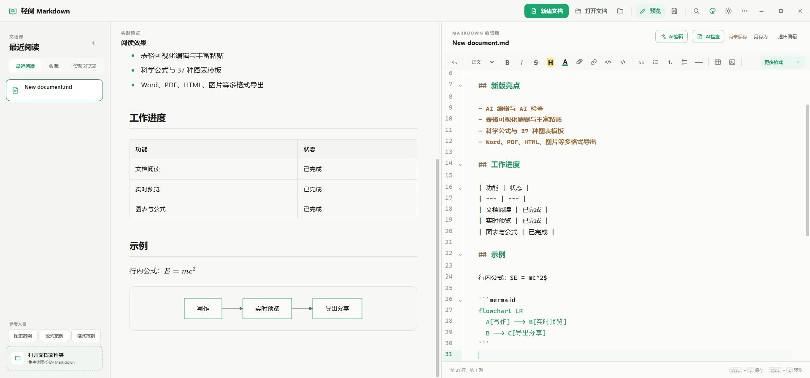
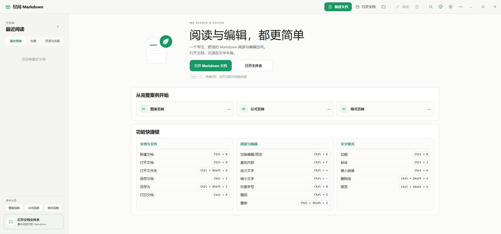
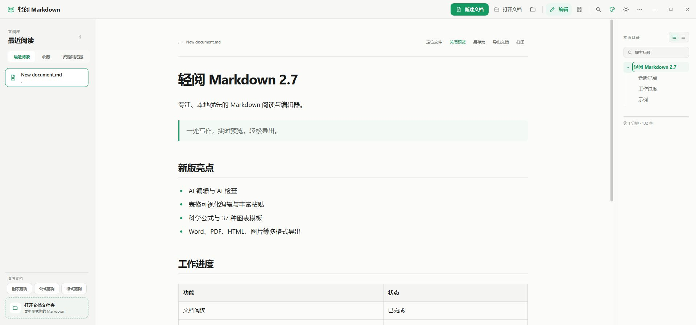

<div align="center">
  
  <h1>轻阅 Markdown</h1>
  <p><strong>快速、本地优先的 Markdown 阅读器、查看器和编辑器——Windows 安装包约 12 MB。</strong></p>
  <p>实时预览 · 语法高亮 · 本地文件 · Windows、macOS、Linux</p>
  <p><strong>简体中文</strong> · <a href="README.en.md">English</a></p>
  <p>
    <a href="https://github.com/liuhang798/quillite-markdown/actions/workflows/release.yml"></a>
    <a href="https://qm.ssssa.cn/#download"></a>
    <a href="LICENSE"></a>
    
  </p>
  <p>
    <a href="https://qm.ssssa.cn/"><strong>🌐 唯一官方网站：qm.ssssa.cn</strong></a>
    ·
    <a href="https://qm.ssssa.cn/#download"><strong>下载最新版本</strong></a>
    · <a href="#项目截图">查看截图</a>
    · <a href="#本地开发">从源码构建</a>
  </p>
</div>

> **官方网站与官方下载：<https://qm.ssssa.cn/>**
> 软件更新、三平台安装包、版本日志与意见反馈均由该站提供，不使用其他根域名或 `www` 域名。



## 为什么选择轻阅 Markdown？

- **真正轻量：**使用 Go + Wails 构建，不依赖 Electron，Windows 安装包约 **12 MB**。
- **本地优先：**直接读取和保存电脑中的普通 Markdown 文件，无需账号、专用仓库或云端绑定。
- **阅读编辑一体：**既有专注的 Markdown 阅读模式，也有左侧实时预览、右侧语法高亮的分栏编辑模式；实时预览采用适合分栏阅读的清晰字号，并继续跟随全局字号缩放。
- **完整桌面体验：**最近阅读、文档收藏、资源浏览器、自动保存、原生文件窗口、文件关联和更新提醒一应俱全。
- **跨平台开源：**采用 MIT 许可证，同时支持 Windows、macOS 和 Linux。

适合阅读长篇 Markdown 文档、编辑 README、维护技术笔记，以及集中管理本地文档文件夹。

## 产品改进计划

“关于轻阅 Markdown”提供“参与产品改进计划”勾选项，该开关只控制异常日志：启用后，软件发生异常时后台静默提交清理本地路径后的错误日志、服务器解析的国家/省/市、Windows／macOS／Linux 系统类型和软件版本；取消勾选后不再提交错误日志。

每日活跃统计独立于该开关，无论是否勾选，每台设备每天最多提交一次匿名活跃记录。记录仅包含随机生成并保存在本地的匿名安装标识、软件版本、系统类型、CPU 架构和服务器解析的国家/省/市；服务器只保存该标识的不可逆哈希，不保存来源 IP。不会上传 Markdown 内容、文件名、文件路径、联系方式或具体操作行为；断网、内网、超时和接口异常均静默忽略，不影响软件功能。

“意见反馈”是用户主动提交的独立功能，不受产品改进计划开关影响。用户可选择功能建议或功能异常，并自行决定是否填写邮箱、手机和上传问题截图；软件版本与系统版本会随反馈一并提交。服务器会记录反馈请求 IP，并通过离线地域库解析国家、省份和城市，仅供登录后的管理员在反馈详情中查看；当前 Markdown 文档不会上传。服务器后台删除一条反馈时，会同步永久删除该反馈的全部图片。

## 下载

| 平台 | 安装包 | 下载 |
|---|---|---|
| Windows x64 | 分步安装程序（`.exe`） | [前往官网下载](https://qm.ssssa.cn/#download) |
| macOS | Intel + Apple Silicon 通用版（`.dmg`） | [前往官网下载](https://qm.ssssa.cn/#download) |
| Linux x64 | Debian 安装包 + 便携 AppImage | [前往官网下载](https://qm.ssssa.cn/#download) |

Windows 用户运行 `quillite-markdown-版本-windows-amd64.exe`，按安装向导操作即可；安装程序支持创建桌面快捷方式、Markdown 文件关联、升级时沿用上次安装目录，并在安装完成后直接启动软件。Windows 的安装、升级与卸载流程统一使用简体中文；全新安装默认以简体中文启动软件，进入软件后仍可切换 English 界面。

macOS 版本会自动跟随电脑的白天/黑夜外观，也允许用户临时手动切换；临时选择会保持到系统下一次切换白天或黑夜模式，随后自动恢复跟随。系统模式变化时界面与原生标题栏同步切换；使用在轻薄标题栏中垂直居中的系统原生窗口控制按钮与应用菜单，半屏平铺和窗口缩放时按钮位置保持稳定。进入全屏后 Logo 和软件名称会自动向左对齐，退出后立即恢复窗口按钮安全间距且不会短暂重叠。支持标准 Command 快捷键：`Command + W` 关闭窗口并留在后台，`Command + Q` 真正退出应用。全屏关闭时会先退出全屏再隐藏到后台；编辑器和资源浏览器采用延迟初始化，减少冷启动等待。

macOS 安装镜像包含禁止元数据索引标记；已安装的应用启动时还会核对镜像布局与 Bundle Identifier，并自动推出仍挂载的官方 DMG，避免镜像内的应用副本显示为第二个“轻阅 Markdown”图标。

通过 macOS 系统窗口、Finder 或文件关联打开的文档与文件夹会保存为系统原生安全书签。最近阅读、收藏和资源浏览器在软件重启后会优先静默恢复读取与编辑权限，并自动刷新过期书签；旧记录或未签名更新导致应用身份变化时，才需要在已定位到原文件的系统窗口中重新授权一次。

## 2.6.0 更新亮点

> **macOS 2.5.0 升级提示：**2.5.0 使用已经停用的裸可执行文件更新方式，无法安全升级到完整应用包。请先从[轻阅官网](https://qm.ssssa.cn/#download)手动安装一次 2.5.1 或更高版本；完成这一次迁移后，后续版本即可继续使用应用内自动更新。

- 新增 PicGo 本机服务与 PicGo Cloud 在线图床，提供首次配置向导、真实上传进度和失败后本地 `assets` 安全回退。
- 新增可视化表格设计器，可编辑单元格、增删和拖动行列、调整对齐与列宽，并原位更新已有 Markdown 表格。
- 新增网页／Word 富文本粘贴转 Markdown、复制为 Markdown／纯文本，以及带候选纠错、忽略和个人词典的离线英文拼写检查。
- 新增统一“导出文档”中心，原生支持 DOCX、两类 HTML、PDF、PNG/JPEG，并可通过可选 Pandoc 导出 EPUB、RTF、ODT、LaTeX、MediaWiki 与自定义格式。
- PNG/JPEG 长文档按 A4 比例逐页 2 倍高清渲染，自动生成连续编号图片，避免超长单图在看图软件和社交平台中被缩成模糊预览。
- PDF 导出可生成标题书签，并修复长代码、连接字符串、宽表格和图表超出 A4 页面的问题；导出按钮加入忙碌锁定和最外层错误提示。
- 本页目录新增标题搜索、层级／平铺视图和折叠记忆；正文 `[TOC]` 可实时生成动态目录，并保留到 HTML／PDF 导出。
- 新建文档加入 3 秒防连点保护，避免按钮或快捷键重复创建文件。

## 2.4.8 更新亮点

- 右侧“本页目录”会按显示器物理短边连续适配字号和默认宽度，在 1080p、2K 与 4K 屏幕上保持清晰，同时保留用户手动设置的目录宽度。
- 最近阅读支持多文档持久置顶，可通过拖柄或键盘方向键排序；置顶项不占普通最近记录的 10 条名额。
- 修复最近列表已满时草稿另存可能误淘汰普通记录的问题，并确保草稿路径、置顶、收藏和最近记录一致迁移。
- 微信或其他临时目录中的文档被移动、删除后，会在最近阅读中标记为不可用，不再重复刷新或误报软件异常；已打开的预览保留最后一次内容。
- 意见反馈由服务器记录请求 IP 并离线解析国家、省份和城市，仅供管理员在反馈详情中查看；软件提交前会明确说明，且不会上传当前文档。

## 2.4.7 更新亮点

- 设置菜单中的“检查更新”不再显示 `GitHub` 字样，界面更加简洁，并准确体现更新与下载均由轻阅官网提供。
- 更新检查、应用内免安装更新和安装包下载继续统一使用唯一官网 `qm.ssssa.cn`。

## 2.4.6 更新亮点

- 官网、更新、下载、统计和反馈统一迁移到唯一域名 `qm.ssssa.cn`，不再依赖根域名或 `www` 子域名。
- Windows 安装程序恢复为官网与 GitHub Release 的 EXE 直链；Windows 免安装更新使用独立 BIN 文件。macOS 更新必须下载并原子替换经过签名校验的完整 `.app` ZIP，禁止再以裸可执行文件覆盖应用包，避免触发系统 `Code Signature Invalid` 启动拦截。
- 官网按版本、平台和来源汇总更新检查与实际下载次数，不上传文档、路径或设备身份。

## 2.4.5 更新亮点

- 新增官网意见反馈入口，可提交功能建议或功能异常、可选联系方式和问题截图，软件及系统版本会自动带入。
- 新增 Word／PDF 导出、阅读页“另存为”、只读文档“另存为副本并编辑”，并完善高分辨率显示、目录树、通知与编辑定位体验。

## 2.4.4 更新亮点

- 标题栏书本图标进一步下移微调，与“轻阅 Markdown”文字的视觉基线更加自然。
- 最近阅读列表移除右侧悬浮垃圾桶图标，释放更多横向空间显示长文档名称。
- 移除最近阅读记录仍可通过文档右键菜单完成，不会删除原文件。

## 2.4.3 更新亮点

- 默认品牌绿统一为精确的 `#159A63`；主按钮不再自动加深为 `#10744A`，按钮、选中态、强调文字及应用图标保持同一绿色。
- 左上角品牌标识改为透明背景的打开书本图形，书本线条跟随当前主题色，不再使用方形底板、边框或阴影。
- 标题栏书本图标与“轻阅 Markdown”文字采用一致的视觉高度并上下居中对齐，Windows 与 macOS 紧凑标题栏分别适配。
- 取消新建文档、回到顶部、首页叶子图标等主题色按钮的投影阴影，界面更干净利落；选中状态仍保留主题色描边标识。
- Windows 安装、升级与卸载向导统一为简体中文，不再显示安装语言选择窗口；系统兼容提示、WebView2 安装提示和文件打开方式等细节同步中文化。
- 文字放大缩小作用于全局：阅读正文、左侧最近阅读/资源浏览器、右侧本页目录同步缩放。
- 左侧文档库与右侧目录分隔条不再限制最大宽度，可自由调整并自动记忆。

## 2.4.2 更新亮点

- 编辑分栏（左侧实时预览 / 右侧编辑器）新增可拖动分隔条，无最大宽度限制，自由调整两侧宽度并自动记忆。
- 编辑模式新增“格式刷”：选中一段带格式的文本（加粗、斜体、删除线、高亮、行内代码、标题、引用或列表），点击工具栏格式刷复制格式，再选中目标文本即自动应用，按 `Esc` 取消。

## 2.4.1 更新亮点

- 编辑时左侧实时预览跟随光标滚动：光标移到哪一行，预览就定位到对应的章节或段落，边写边看排版效果。
- 编辑器头部新增“退出编辑”按钮，一键离开编辑状态回到沉浸式阅读页。
- 插入代码块时可选择常用编程语言（JavaScript、Python、Go、Java、C/C++、Rust、HTML、SQL 等 19 种），自动写入带语言标识的围栏代码块并高亮。

## 2.4.0 更新亮点

- 修复 Windows 应用内更新的文件占用问题：更新 helper 从独立临时 exe 运行，不再锁住待替换的主程序。
- 新版本下载并校验后可自动关闭旧版、覆盖程序并重新打开，无需再次运行安装向导。
- 更新失败时会在用户配置目录的 `轻阅 Markdown/update/apply-update.log` 中记录明确原因。
- 旧客户端的 updater 无法自行修复，因此需要手动安装 2.3.12 或更高版本一次；之后即可使用应用内无安装更新。

## 2.3.5 更新亮点

- 兼容纯文本 TXT 文件：阅读页与编辑实时预览按纯文本渲染（保留原格式，不解析 Markdown 语法），编辑模式使用纯文本语法；支持从打开对话框、拖放或文件夹浏览直接打开，安装时注册 `.txt` 文件关联，双击即可打开。
- 插入图片支持两种方式：选择本地图片，或粘贴 `http/https` 在线图片链接（可附图片说明）。
- 从微信、企业微信等聊天软件直接打开缓存附件时，进入编辑页前会检测写权限；只读、被占用或权限不足的文件会保持在阅读页并提示先另存为可编辑副本，无需管理员权限，也不会删除原附件。
- 新增应用内自动更新：检测到新版本后可直接“下载并更新”，应用内下载（带进度条）、校验完整性后自动替换并重启，无需手动下载安装或再到系统设置授权；macOS 与 Windows 均支持，Linux 保持手动下载。

## 2.3.4 更新亮点

- 当前文档被其他软件修改后，切回轻阅 Markdown 会自动重新读取并刷新预览；本软件存在未保存编辑时不会覆盖当前内容。
- “更多”菜单新增文档宽度调整：窄 / 中 / 宽 / 全宽四档，阅读页与编辑实时预览同步生效并自动记忆。
- 修复阅读页查找无法匹配 Markdown 行内代码和代码块内容的问题，代码文字现在会正常计数、高亮并定位。

## 2.3.3 更新亮点

- 文档预览支持鼠标滚轮缩放：Windows/Linux 使用 `Ctrl + 滚轮`，macOS 使用 `Command + 滚轮`，阅读页与编辑模式实时预览均可使用并自动记忆字号。
- 修复 Windows 覆盖安装时快捷方式或 Markdown 文件关联图标被资源管理器占用而中断的问题；若旧版仍在运行，安装器会提供关闭旧版并继续的选项。
- 新增持久化“收藏”视图；可在最近阅读或资源浏览器中右键收藏文档，收藏列表重启后仍保留。
- 最近阅读、收藏和资源浏览器中的已收藏文档会显示主题色实心五角星，浏览列表时可快速区分。
- 右键菜单会根据当前状态显示“收藏文档”或“取消收藏”；取消收藏只移除记录，绝不会删除原文件。
- 已移动、删除或磁盘暂时不可用的收藏仍会显示为不可用记录，方便用户稍后清理。

## 主要功能

- 美观舒适的 Markdown 阅读与编辑界面。
- 支持打开、阅读和编辑纯文本 `.txt` 文件：阅读页按纯文本渲染（保留原格式，不解析 Markdown 语法），编辑模式使用纯文本语法，并可注册 `.txt` 文件关联双击打开。
- 插入图片支持两种方式：选择本地图片，或粘贴 `http/https` 在线图片链接（可附图片说明）。
- 左侧实时预览、右侧 Markdown 语法高亮编辑。
- 编辑工具栏覆盖 H1–H6、加粗、斜体、删除线、高亮、文字颜色、链接、行内/块级代码、引用、列表、任务、分隔线、表格和图片；文字颜色按钮紧跟高亮，提供默认色、7 档灰阶和 40 个综合色阶组成的 48 色完整方格色板，可实时预览、再次换色、恢复默认颜色并完整撤回。空间不足时工具栏自动把按钮收进“更多格式”，不再出现横向滚动条；“更多格式”使用即时响应的应用内菜单，还可插入粗斜体、下划线、上下标、学科公式、37 类图表（22 类 Mermaid + 15 类数据图表）、强制换行、脚注、引用式链接、自动链接、转义符号、HTML/折叠区块、键盘按键和注释。常用格式支持 `Ctrl/Cmd + B`、`Ctrl/Cmd + I`、`Ctrl/Cmd + K`、`Ctrl/Cmd + Shift + X`、`Ctrl/Cmd + Shift + H`。
- 内置可视化表格设计器：直接编辑单元格，动态修改行列数量，增删或拖动排序行列，设置每列左／中／右对齐，并拖动边界调整列宽。光标放在已有 Markdown 表格内再次点击表格按钮即可原位编辑；保存后仍是兼容其他 Markdown 软件的标准 GFM 表格。
- 支持网页与 Word 富文本粘贴：剪贴板 HTML 自动转换为 Markdown，保留标题、强调、列表、引用、代码、链接、在线图片和 GFM 表格，并清理 Office 专有样式与不安全地址。编辑器选中文字后右键可选择“复制为 Markdown”或“复制为纯文本”。
- 内置离线英文拼写检查：错词显示红色波浪线，右键可采用候选纠错、在当前文档中忽略或加入个人词典；“更多 → 拼写检查”可启停功能、切换自动／美式／英式词典并清空个人词典。代码、链接地址、公式、缩写和驼峰标识会自动排除，检查过程不会上传文档内容。
- 内置“学科公式”、KaTeX 数学排版与 mhchem 化学公式：一个统一入口按基础数学、代数与函数、几何、微积分、线性代数、概率统计、物理、基础化学和化学反应分类提供 79 种常用模板；填写参数、选择行内/块级/编号方式即可生成并插入 Markdown，弹窗内可直接打开教程。同时支持 `$…$` / `\(…\)` 行内公式、`$$…$$` / `\[…\]` 块级公式、`\ce{…}` 化学式及 `\tag{…}` 手动编号。[查看公式与化学式使用教程](https://qm.ssssa.cn/guides/formulas/)。
- 支持 Typora 风格 Mermaid 图表：在 ` ```mermaid ` 围栏代码块中编写 Mermaid 源码，即可实时显示流程图、时序图、甘特图等图表。编辑器“更多格式 → 图表生成器”按用途提供 22 类常用模板，可查看说明、编辑源码、实时预览并一键插入。图表适配明暗模式，语法错误只在对应图表位置提示；Word／HTML／PDF 导出保持预览排版。[查看 22 类 Mermaid 图表完整案例](docs/Mermaid-图表完整案例.md)。
- 图表生成器另提供 15 类离线数据图表：柱状、折线、堆叠柱状、面积、散点、正反向对比、柱线组合、漏斗、热力、箱线、气泡、仪表盘、环形、瀑布和词云。图表源码以可编辑的 ` ```echarts ` JSON 保存在 Markdown 中，不依赖网络服务；预览为 SVG，Word／HTML／PDF 导出与软件显示保持一致。[查看数据图表使用案例](docs/ECharts-数据图表案例.md)。
- 左下角内置“图表范例”“公式范例”“格式范例”三个参考入口，分别覆盖全部 37 类图表、79 种学科公式和编辑器支持的常规 Markdown／HTML 文本格式；参考文档不会占用“最近阅读”列表。
- 阅读页可通过“关闭预览”直接返回软件首页，最近阅读记录不会被删除；首页集中展示三份完整案例，并列出文档、阅读、编辑和文字格式的全部常用快捷键。
- 插入代码块时可选择常用编程语言（JavaScript、Python、Go、Java、C/C++、Rust、HTML、SQL 等），自动写入带语言标识的围栏代码块并高亮；编辑器头部提供“退出编辑”按钮，随时回到沉浸式阅读页。
- 支持工具栏或 `Ctrl/Cmd + Z` 连续撤回；不同文档的撤回历史相互隔离，无法撤销掉刚打开时的原始内容。
- 编辑状态下使用 `Ctrl/Cmd + F` 会直接查找 Markdown 源码，高亮匹配项并滚动定位；查找替换面板支持中英文界面并与整体视觉风格保持一致。
- 支持新建 Markdown 文件并立即编辑，编辑期间每 10 秒自动保存。
- 阅读页使用单一“导出文档”入口：无需额外工具即可导出 Word、带样式 HTML、无样式 HTML、带标题书签 PDF、PNG/JPEG 高清图片。图片默认按 A4 高度逐页独立进行 2 倍高清渲染，保存为连续编号图片，不经过整张缩放或二次采样；即使选择“单张长图”，超过 3 张 A4 的长文档也会自动改为 A4 高清分页，避免看图软件或社交平台把数万像素高的图片缩成模糊缩略图。3 页以内的短文档仍可选择 1280px 排版、约 2560px 宽的无损单张长图。支持 `{title}`、`{date}`、`{page}` 页眉页脚和可复用导出预设。PDF 自动使用本机 Edge／Chrome／Chromium 生成可导航书签，不会增大安装包；未找到可用浏览器时回退系统打印。安装本机 [Pandoc](https://pandoc.org/installing.html) 后可继续导出 EPUB、RTF、ODT、LaTeX、MediaWiki，或指定 writer、扩展名与附加参数生成自定义格式。Pandoc 为可选依赖，不会增大轻阅安装包。
- 支持 PicGo Cloud 在线图床直连：在“更多 → 图床设置”中选择“PicGo 在线图床”，通过系统浏览器安全登录即可上传，无需安装 PicGo 或复制密钥；免费额度和后续计费由 PicGo Cloud 提供。登录令牌独立保存在本机配置目录，不进入普通偏好文件。选择、拖拽或粘贴图片仍会先保存到文档旁的 `assets`，再使用预签名／分片 API 上传并插入在线 URL；上传时显示加载动画、真实百分比和生成链接状态，失败自动回退本地相对路径，保证图片不丢失。已安装 PicGo 的用户仍可选择“本机 PicGo”兼容模式，其 Server 连接仅允许 localhost／回环地址。
- 内置意见反馈：支持功能建议／功能异常分类、可选联系方式、最多 5 张截图、自动软件与系统版本信息；管理员可在官网后台查看、标记已解决或连同图片一起删除。
- 右侧目录支持标题搜索和“层级／平铺”切换：层级模式可单独折叠并按文档记忆状态，搜索时保留命中标题的上级路径；平铺模式方便快速浏览全部标题。正文单独一行输入 `[TOC]` 会生成随标题实时更新的可点击目录，并保留到 HTML／PDF 导出。目录仍支持当前章节跟随、分隔条调宽及 1080p／2K／4K 字号适配。
- 左侧文档库和右侧本页目录支持拖动分隔条调整宽度，并在下次启动时恢复上次布局。
- 资源浏览器自动记忆已选文件夹和当前视图，下次启动继续显示；再次点击已激活的“资源浏览器”可更换文件夹。
- 收藏文档独立于最近阅读；可从最近阅读和资源浏览器右键收藏，并在“收藏”视图中打开、编辑、定位或取消收藏。
- 打开文档后立即进入最近阅读，文档名下方显示文件所在目录并支持悬停查看完整路径，便于区分同名文件；右键记录可置顶、取消置顶、编辑、另存为、收藏、定位或移除。置顶文档长期保留在顶部，可用拖柄拖动或键盘方向键排序，其下仍保留最多 10 条普通最近记录。原文件已删除、移动或暂时无法访问时，记录会显示为灰色删除线且不可打开，但仍可取消置顶或移除。
- macOS 关闭主窗口后应用继续在后台运行；再次点击 Dock 图标会恢复窗口并置于最前方，从 Finder 打开关联的 Markdown 文件会直接显示文档。
- 简体中文和 English 界面切换，并自动记忆语言选择。
- 主题颜色与白天/黑夜模式相互独立：可从清新绿、晴空蓝、活力橙、灵动紫、珊瑚红、湖水蓝、雾蓝灰和陶土棕中选择任意强调色，再自由搭配明暗模式；两项设置都会自动记忆。
- 阅读/编辑字号同步调节，最高支持 200%。首次使用或没有手动字号设置时，会结合物理分辨率和系统 DPI 自动适配：低缩放的 2K/4K 屏幕默认约为 115%/130%，Windows/macOS 已开启高 DPI 缩放时不会重复放大；“更多”菜单还提供自动模式及 100%–200% 快速预设，手动设置优先记忆。
- 左侧可在“最近阅读”“收藏”和“资源浏览器”间切换，支持打开文件夹、刷新文件列表并集中浏览 Markdown。
- 原生打开/保存窗口，关联 `.md`、`.markdown`、`.mdown`、`.mkd` 文件。
- 单实例打开文件和未保存修改保护。
- 全新分栏阅读/编辑品牌图标，采用透明圆角边缘、无白色方底；应用内 Logo 会跟随主题颜色，系统图标保持默认绿色。“关于”页面包含作者邮箱和可直达的开源仓库。
- 启动时只检查 `qm.ssssa.cn` 官网版本库；发现新版本后可查看官网维护的中英文更新说明，选择“下载并更新”从官网直接完成升级（带进度条，自动重启），或打开 `https://qm.ssssa.cn/#download` 手动安装，也可 30 天内不再自动提醒；设置菜单仍支持手动检查。
- macOS 与 Windows 支持应用内自动更新：新版本由应用自行下载并替换，不会反复触发系统授权提示；macOS 首次安装的 Gatekeeper 提示仍可能因未签名出现。

## Markdown 格式支持

| 分类 | 可编辑并预览的格式 |
|---|---|
| 文本 | 加粗、斜体、粗斜体、删除线、高亮、文字颜色、下划线、上标、下标、行内代码、键盘按键、Markdown 转义 |
| 结构 | H1–H6、段落、引用、分隔线、强制换行、代码块、HTML/折叠区块、HTML 注释 |
| 列表与数据 | 无序列表、有序列表、任务列表、表格 |
| 引用资源 | 普通链接、引用式链接、自动链接、图片、脚注 |
| 科学公式 | LaTeX 行内公式、块级公式、mhchem 化学公式、`\tag{…}` 公式编号 |
| 图表生成器 | 22 类 Mermaid 结构图 + 15 类 ECharts 数据图表，支持源码编辑、实时预览和导出 |

预览以 CommonMark/GFM 为基础；高亮使用 `==文字==`，脚注使用 `[^1]` 与 `[^1]: 内容`。公式由 KaTeX 在本地渲染，化学式示例为 `$\ce{2H2 + O2 -> 2H2O}$`，编号公式可写为 `$$ E=mc^2 \tag{1} $$`。下划线、上下标、折叠区块和键盘按键采用可移植的安全 HTML 标签，并在预览时经过 DOMPurify 清理。

## 项目截图

| 首页 | 阅读界面 |
|---|---|
|  |  |


## Go + Wails 2.0

2.0 版本开始使用 Go 和 Wails 替换 Electron，同时保留现有 HTML/CSS 界面和 CodeMirror 编辑器。当前 Windows 安装包约为 **12 MB**，原 Electron 安装包约为 90 MB。

- 后端：Go 1.23+
- 桌面框架：Wails 2.13
- 前端：HTML、CSS、JavaScript、Vite
- Markdown：marked、DOMPurify、highlight.js
- 编辑器：CodeMirror 6
- Windows 安装：NSIS

## 项目结构

- `main.go`：Wails 应用启动与窗口配置。
- `app.go`：文档、文件夹、最近阅读、偏好设置及桌面系统能力。
- `updates.go`：官网唯一版本库的更新检查、平台安装包映射与版本比较。
- `frontend/`：Markdown 阅读器、CodeMirror 编辑器和双语界面。
- `build/`：应用图标及各平台构建配置。
- `packaging/`：Linux 桌面集成与软件包元数据。
- `scripts/`：可重复执行的项目资源维护脚本。

新建 Markdown 文档时无需选择保存目录。macOS 会固定保存到用户的 `文稿/Quillite Markdown`，避免应用升级覆盖文档；Windows 与 Linux 便携版继续优先使用应用目录，不可写时自动回退到用户文档目录。新建文档另存后会自动删除临时草稿及重复的最近阅读记录。绝对路径和相对路径引用的本地图片均由 Go 后端安全读取，可在预览区正常显示。

## 多平台版本

发布版本标签后，GitHub Actions 会自动生成：

- Windows x64：分步安装的 NSIS 安装程序
- macOS Universal：同时支持 Intel 和 Apple Silicon 的 DMG
- Linux x64：DEB 和 AppImage

当前开发版本尚未配置付费代码签名证书，因此 Windows 首次安装可能出现 SmartScreen 提醒，macOS 首次安装可能出现 Gatekeeper 提醒；应用内自动更新不受影响，无需再次授权。

## 本地开发

需要安装 Go 1.23+、Node.js 22+、Wails 2.13，以及 Wails 对应平台的系统依赖。

```bash
go install github.com/wailsapp/wails/v2/cmd/wails@v2.13.0
wails dev
```

运行测试：

```bash
go test ./...
cd frontend
npm install
npm run build
```

在 macOS 上构建时使用统一脚本，生成的应用包会固定命名为 `轻阅 Markdown.app`：

```bash
bash scripts/build-macos.sh darwin/universal
```

生成 Windows 安装包：

```bash
wails build -clean -platform windows/amd64 -nsis -installscope user -webview2 embed -trimpath
```

推送版本标签后，`.github/workflows/release.yml` 会自动构建三个系统的安装包、保留 GitHub 源码发布记录，并强制把版本日志与安装包同步到官网版本库。客户端只根据官网最新稳定版本提醒和下载更新；缺少官网令牌或同步失败时，发布任务会失败。

## 项目文档

- [项目官网](https://qm.ssssa.cn/)
- [官网源代码](https://github.com/liuhang798/quillite-markdown-website)
- [更新记录](CHANGELOG.md)
- [AI 项目技术指南](AGENTS.md)
- [贡献指南](CONTRIBUTING.md)
- [安全策略](SECURITY.md)
- [发布指南](RELEASING.md)
- [设计验收记录](design-qa.md)

## 开源协议

[MIT](LICENSE)
