# 图表案例大全

> 本文档由轻阅 Markdown 的实际图表模板自动生成，共覆盖 **37 种图表**。在编辑模式中可通过“更多格式 → 图表生成器”选择模板、修改源码并插入文档。

## 覆盖范围

| 分类 | 数量 |
| --- | ---: |
| 流程与项目 | 7 |
| 软件与系统 | 8 |
| 数据分析 | 20 |
| 知识与规划 | 2 |

> 图表源码可以直接修改。Mermaid 图表使用 ```mermaid` 代码块，数据图表使用 ```echarts` JSON 代码块。

---

## 1. 流程图

- 分类：流程与项目
- 用途：业务流程、审批逻辑、程序路径和决策分支；支持直接在画布上添加、连接、拖动和修改节点。
- 引擎：Mermaid

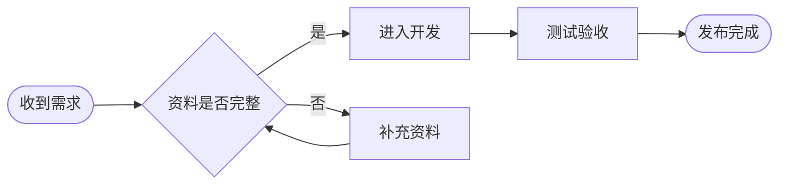

---

## 2. 时序图

- 分类：流程与项目
- 用途：接口调用、登录过程以及客户端和服务器的交互顺序。
- 引擎：Mermaid

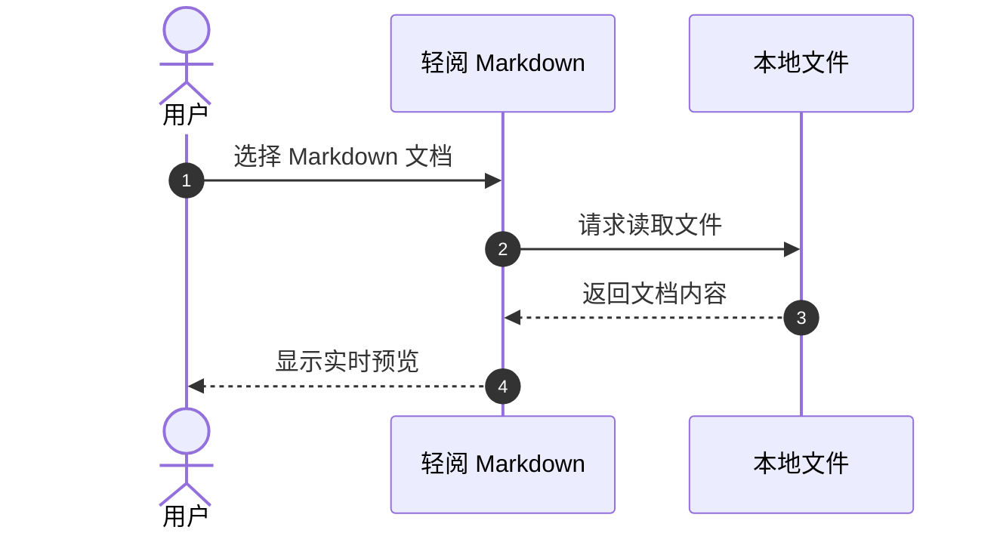

---

## 3. 甘特图

- 分类：流程与项目
- 用途：项目排期、研发计划、任务依赖和里程碑。
- 引擎：Mermaid

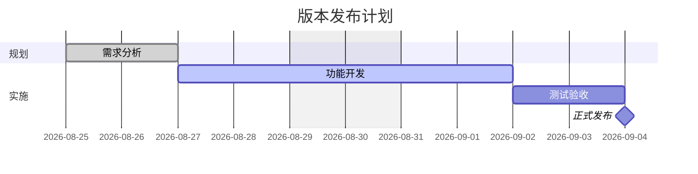

---

## 4. 状态图

- 分类：流程与项目
- 用途：订单、页面或文档的状态机和生命周期。
- 引擎：Mermaid

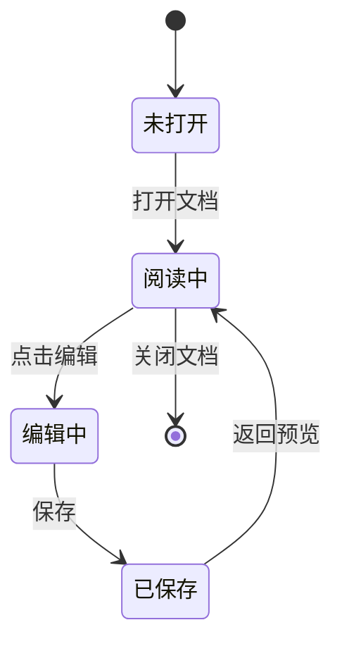

---

## 5. 用户旅程图

- 分类：流程与项目
- 用途：用户体验、服务流程和各步骤满意度。
- 引擎：Mermaid

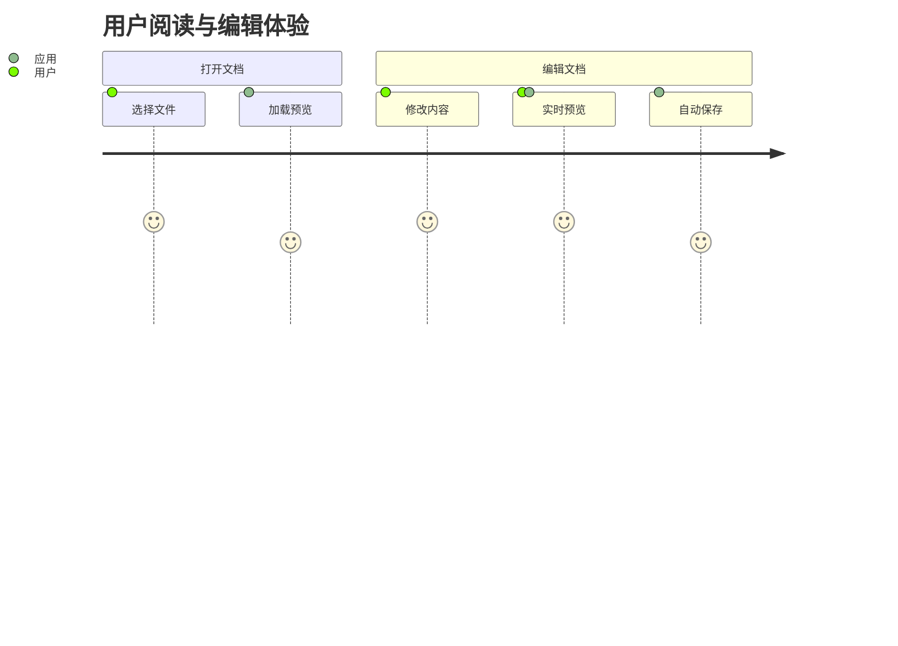

---

## 6. 时间线

- 分类：流程与项目
- 用途：产品发展、事件历史和阶段性成果。
- 引擎：Mermaid

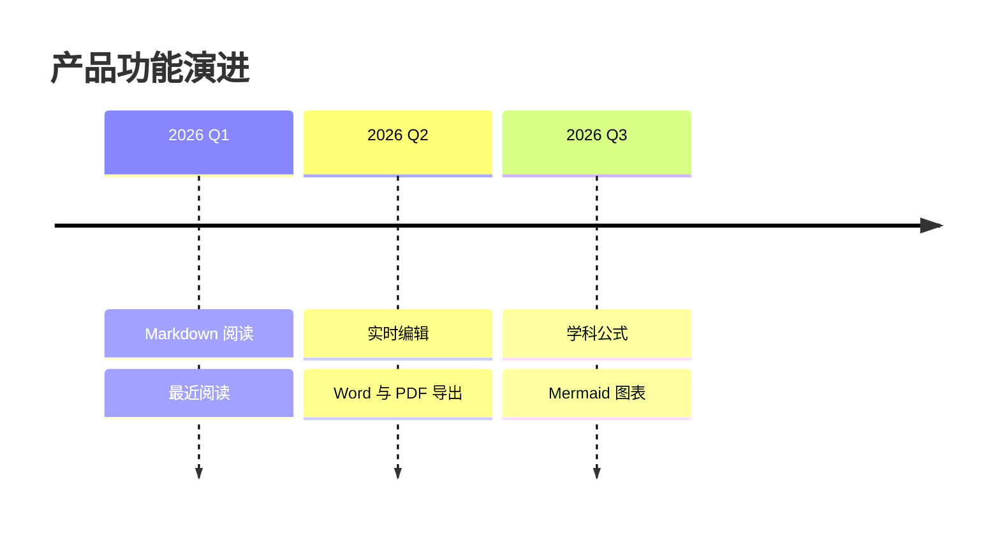

---

## 7. 看板

- 分类：流程与项目
- 用途：待办、进行中、测试中和已完成任务。
- 引擎：Mermaid

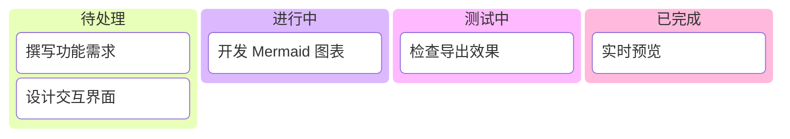

---

## 8. 类图

- 分类：软件与系统
- 用途：类属性、方法和面向对象关系。
- 引擎：Mermaid

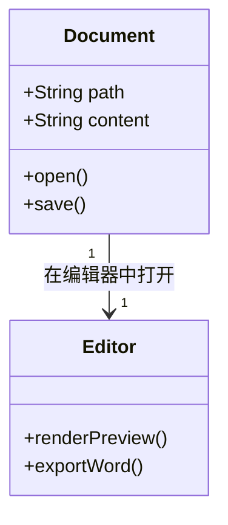

---

## 9. 实体关系图

- 分类：软件与系统
- 用途：数据库表结构、字段和一对多关系。
- 引擎：Mermaid

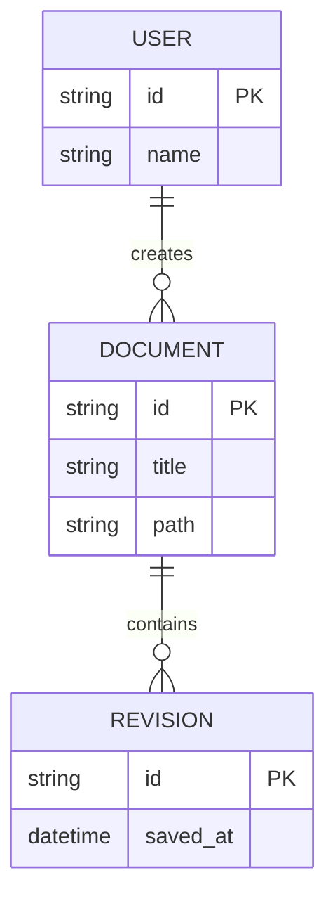

---

## 10. 需求图

- 分类：软件与系统
- 用途：软件需求、验证方法以及组件追踪关系。
- 引擎：Mermaid

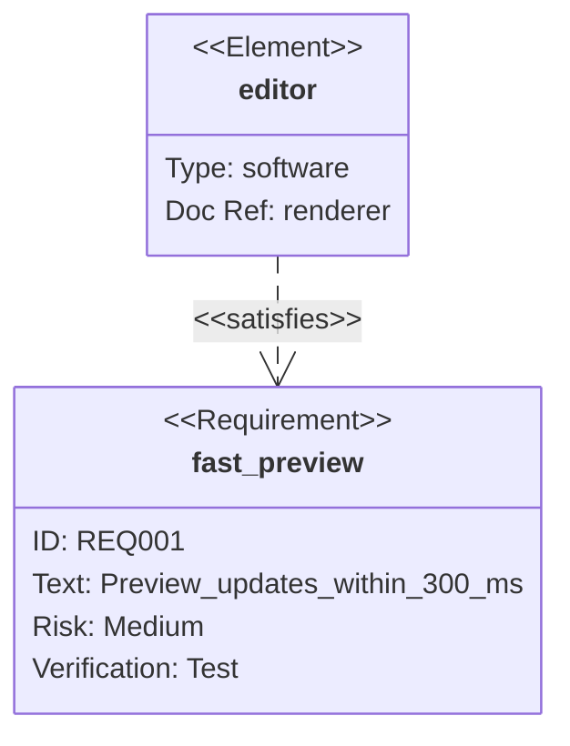

---

## 11. Git 分支图

- 分类：软件与系统
- 用途：版本分支、提交记录和合并过程。
- 引擎：Mermaid

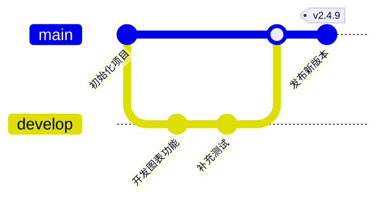

---

## 12. 块图

- 分类：软件与系统
- 用途：系统模块、硬件模块和数据处理管线。
- 引擎：Mermaid


---

## 13. 数据包图

- 分类：软件与系统
- 用途：网络协议、二进制数据和字段位宽。
- 引擎：Mermaid

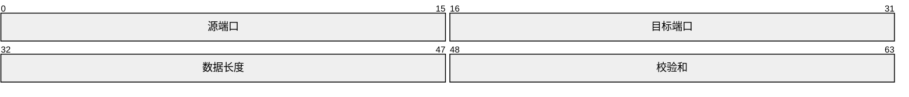

---

## 14. 架构图

- 分类：软件与系统
- 用途：系统服务、模块分组、存储与连接关系。
- 引擎：Mermaid

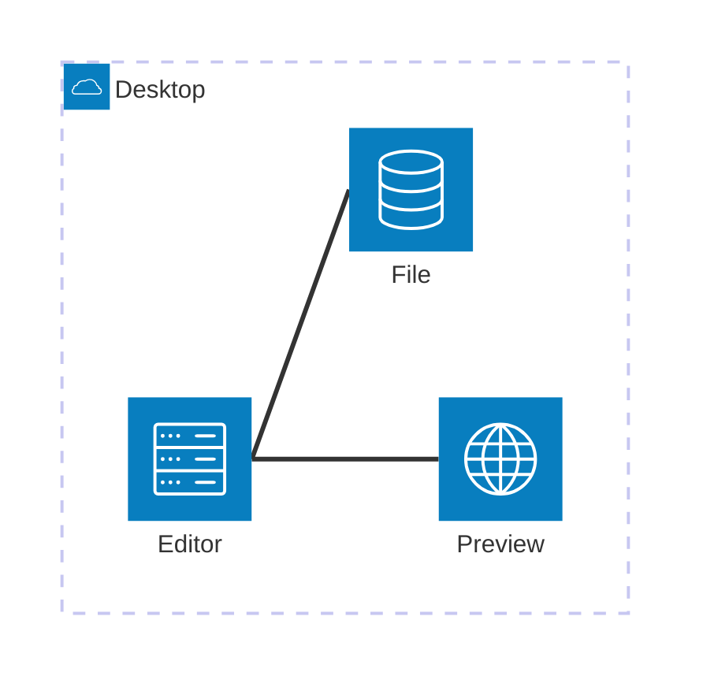

---

## 15. C4 系统上下文图

- 分类：软件与系统
- 用途：从用户和外部系统视角说明软件边界。
- 引擎：Mermaid

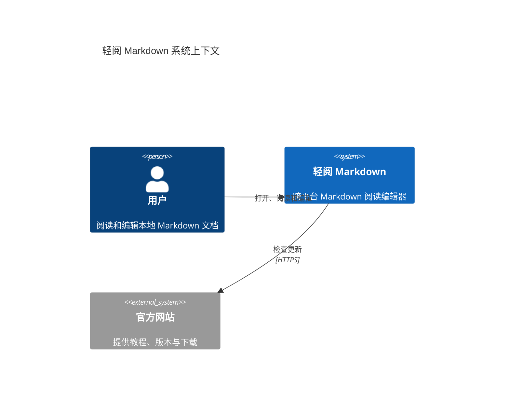

---

## 16. 饼图

- 分类：数据分析
- 用途：分类占比和构成比例。
- 引擎：Mermaid

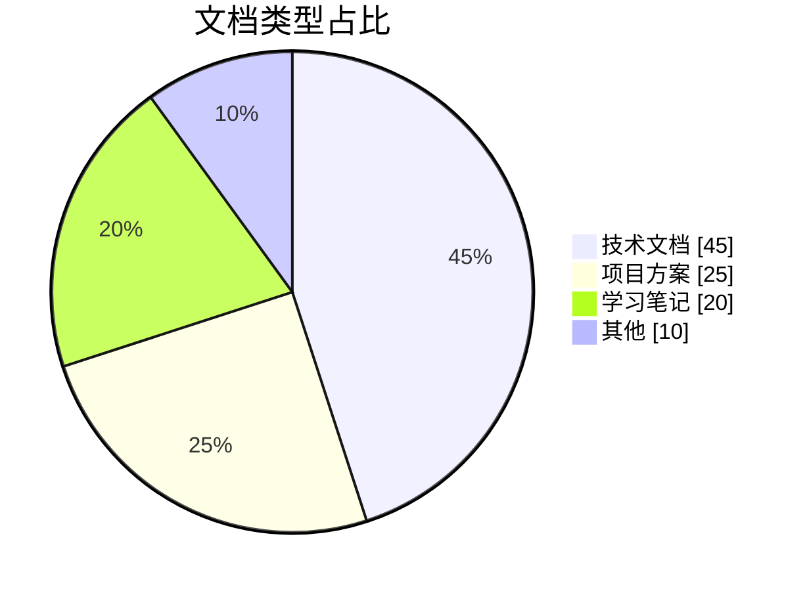

---

## 17. 象限图

- 分类：数据分析
- 用途：任务优先级、产品定位和二维指标。
- 引擎：Mermaid

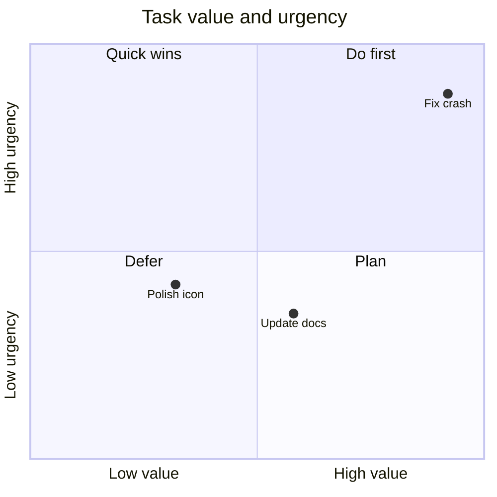

---

## 18. XY 图表

- 分类：数据分析
- 用途：趋势折线、数量柱状图和多组数据对比。
- 引擎：Mermaid

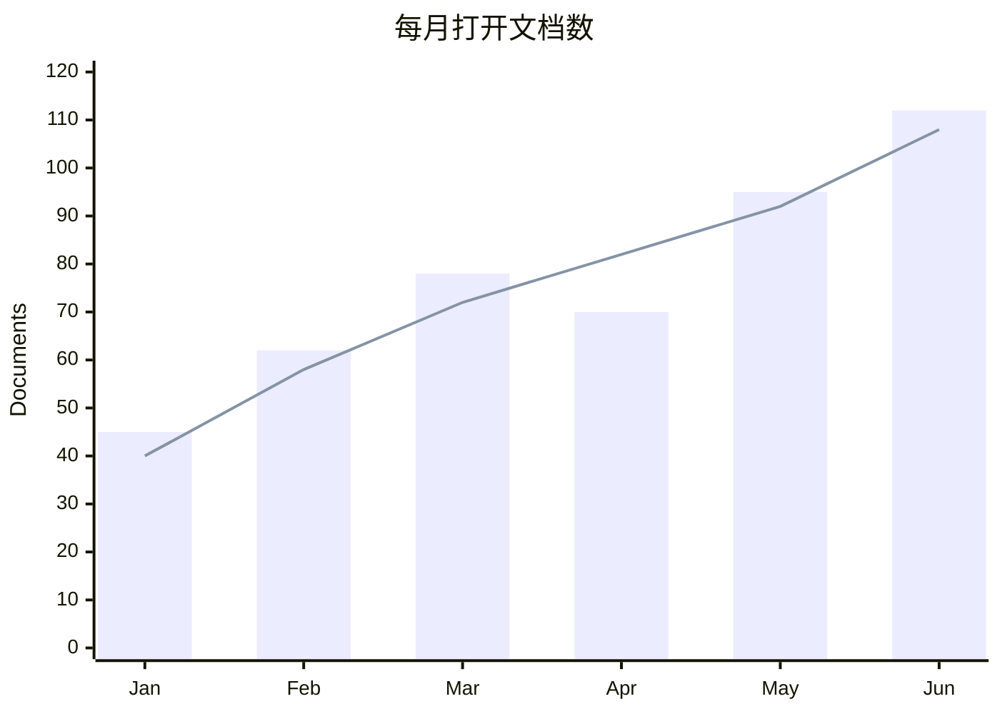

---

## 19. 桑基图

- 分类：数据分析
- 用途：流量、能量、资金或数据的去向与占比。
- 引擎：Mermaid

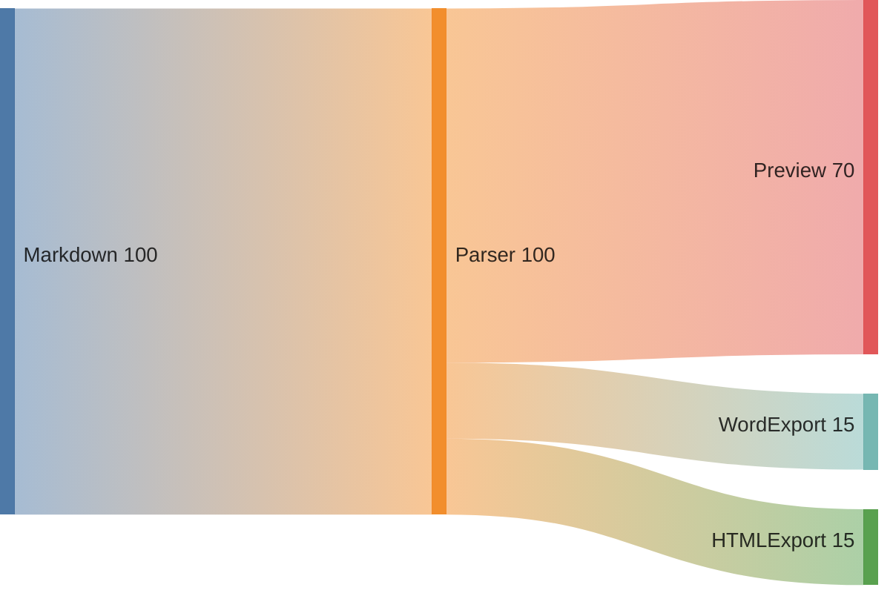

---

## 20. 雷达图

- 分类：数据分析
- 用途：多维能力评估和指标综合对比。
- 引擎：Mermaid

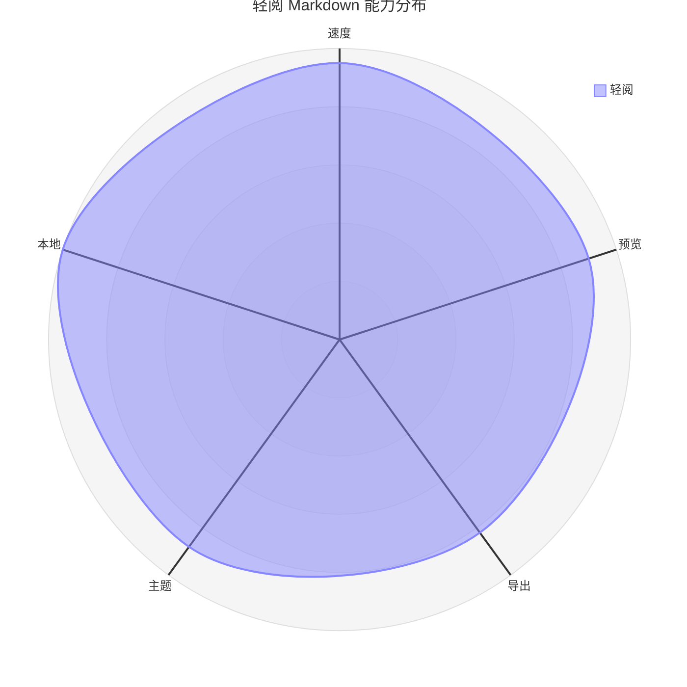

---

## 21. 树状矩形图

- 分类：数据分析
- 用途：用面积展示层级数据和各部分占比。
- 引擎：Mermaid

```mermaid
treemap-beta
    "轻阅 Markdown"
        "阅读": 35
        "编辑": 30
        "导出": 20
        "图表": 15
```

---

## 22. 柱状图

- 分类：数据分析
- 用途：比较不同分类的数量、金额或频次。
- 引擎：ECharts

```echarts
{
  "title": {
    "text": "月度文档数量",
    "left": "center"
  },
  "tooltip": {
    "trigger": "axis"
  },
  "xAxis": {
    "type": "category",
    "data": [
      "一月",
      "二月",
      "三月",
      "四月",
      "五月",
      "六月"
    ]
  },
  "yAxis": {
    "type": "value",
    "name": "文档数"
  },
  "series": [
    {
      "name": "文档数",
      "type": "bar",
      "data": [
        42,
        58,
        76,
        69,
        91,
        108
      ]
    }
  ]
}
```

---

## 23. 折线图

- 分类：数据分析
- 用途：展示连续时间内的趋势和变化速度。
- 引擎：ECharts

```echarts
{
  "title": {
    "text": "阅读时长趋势",
    "left": "center"
  },
  "tooltip": {
    "trigger": "axis"
  },
  "xAxis": {
    "type": "category",
    "boundaryGap": false,
    "data": [
      "周一",
      "周二",
      "周三",
      "周四",
      "周五",
      "周六",
      "周日"
    ]
  },
  "yAxis": {
    "type": "value",
    "name": "分钟"
  },
  "series": [
    {
      "name": "阅读时长",
      "type": "line",
      "data": [
        18,
        26,
        21,
        34,
        42,
        55,
        48
      ]
    }
  ]
}
```

---

## 24. 堆叠柱状图

- 分类：数据分析
- 用途：同时比较总量和各组成部分。
- 引擎：ECharts

```echarts
{
  "title": {
    "text": "导出类型分布",
    "left": "center"
  },
  "tooltip": {
    "trigger": "axis"
  },
  "legend": {
    "top": 30
  },
  "xAxis": {
    "type": "category",
    "data": [
      "一季度",
      "二季度",
      "三季度",
      "四季度"
    ]
  },
  "yAxis": {
    "type": "value"
  },
  "series": [
    {
      "name": "Word",
      "type": "bar",
      "stack": "total",
      "data": [
        32,
        41,
        48,
        53
      ]
    },
    {
      "name": "PDF",
      "type": "bar",
      "stack": "total",
      "data": [
        24,
        30,
        39,
        45
      ]
    },
    {
      "name": "HTML",
      "type": "bar",
      "stack": "total",
      "data": [
        12,
        18,
        21,
        27
      ]
    }
  ]
}
```

---

## 25. 面积图

- 分类：数据分析
- 用途：突出趋势变化和累计规模。
- 引擎：ECharts

```echarts
{
  "title": {
    "text": "累计阅读量",
    "left": "center"
  },
  "tooltip": {
    "trigger": "axis"
  },
  "xAxis": {
    "type": "category",
    "boundaryGap": false,
    "data": [
      "一月",
      "二月",
      "三月",
      "四月",
      "五月",
      "六月"
    ]
  },
  "yAxis": {
    "type": "value",
    "name": "篇次"
  },
  "series": [
    {
      "name": "阅读量",
      "type": "line",
      "smooth": true,
      "areaStyle": {},
      "data": [
        120,
        182,
        251,
        334,
        442,
        581
      ]
    }
  ]
}
```

---

## 26. 散点图

- 分类：数据分析
- 用途：观察两个连续变量之间的相关性和离群点。
- 引擎：ECharts

```echarts
{
  "title": {
    "text": "文档长度与阅读时长",
    "left": "center"
  },
  "tooltip": {
    "trigger": "item"
  },
  "grid": {
    "left": 62,
    "right": 76,
    "top": 62,
    "bottom": 58,
    "containLabel": true
  },
  "xAxis": {
    "type": "value",
    "name": "字数（千字）",
    "nameLocation": "middle",
    "nameGap": 30
  },
  "yAxis": {
    "type": "value",
    "name": "阅读时长（分钟）",
    "nameLocation": "middle",
    "nameGap": 38
  },
  "series": [
    {
      "name": "文档",
      "type": "scatter",
      "symbolSize": 15,
      "data": [
        [
          1.2,
          4
        ],
        [
          2.4,
          7
        ],
        [
          3.1,
          9
        ],
        [
          4.8,
          16
        ],
        [
          5.4,
          14
        ],
        [
          7.2,
          23
        ],
        [
          8.5,
          28
        ]
      ]
    }
  ]
}
```

---

## 27. 正反向对比图

- 分类：数据分析
- 用途：从中心线向左右比较两组相反或对立指标。
- 引擎：ECharts

```echarts
{
  "title": {
    "text": "功能满意与不满意对比",
    "left": "center"
  },
  "tooltip": {
    "trigger": "axis"
  },
  "legend": {
    "top": 30
  },
  "grid": {
    "left": 92,
    "right": 76,
    "top": 72,
    "bottom": 56,
    "containLabel": true
  },
  "xAxis": {
    "type": "value",
    "min": -100,
    "max": 100,
    "name": "比例（%）",
    "nameLocation": "middle",
    "nameGap": 30
  },
  "yAxis": {
    "type": "category",
    "data": [
      "阅读体验",
      "编辑体验",
      "导出功能",
      "主题外观"
    ]
  },
  "series": [
    {
      "name": "不满意",
      "type": "bar",
      "stack": "compare",
      "data": [
        -18,
        -24,
        -31,
        -12
      ]
    },
    {
      "name": "满意",
      "type": "bar",
      "stack": "compare",
      "data": [
        78,
        72,
        64,
        85
      ]
    }
  ]
}
```

---

## 28. 组合图（柱状＋折线）

- 分类：数据分析
- 用途：使用双坐标轴同时展示规模和变化率。
- 引擎：ECharts

```echarts
{
  "title": {
    "text": "下载量与增长率",
    "left": "center"
  },
  "tooltip": {
    "trigger": "axis"
  },
  "legend": {
    "top": 30
  },
  "xAxis": {
    "type": "category",
    "data": [
      "一月",
      "二月",
      "三月",
      "四月",
      "五月",
      "六月"
    ]
  },
  "yAxis": [
    {
      "type": "value",
      "name": "下载量"
    },
    {
      "type": "value",
      "name": "增长率（%）"
    }
  ],
  "series": [
    {
      "name": "下载量",
      "type": "bar",
      "data": [
        320,
        410,
        520,
        610,
        780,
        920
      ]
    },
    {
      "name": "增长率",
      "type": "line",
      "yAxisIndex": 1,
      "data": [
        8,
        12,
        15,
        11,
        19,
        18
      ]
    }
  ]
}
```

---

## 29. 漏斗图

- 分类：数据分析
- 用途：展示流程各阶段的转化和流失。
- 引擎：ECharts

```echarts
{
  "title": {
    "text": "用户转化漏斗",
    "left": "center"
  },
  "tooltip": {
    "trigger": "item"
  },
  "series": [
    {
      "name": "转化",
      "type": "funnel",
      "top": 55,
      "bottom": 20,
      "label": {
        "show": true,
        "position": "inside"
      },
      "data": [
        {
          "value": 100,
          "name": "访问官网"
        },
        {
          "value": 72,
          "name": "下载安装"
        },
        {
          "value": 54,
          "name": "首次打开"
        },
        {
          "value": 41,
          "name": "持续使用"
        }
      ]
    }
  ]
}
```

---

## 30. 热力图

- 分类：数据分析
- 用途：用颜色深浅展示二维数据密度或相关程度。
- 引擎：ECharts

```echarts
{
  "__quillite": {
    "height": 460
  },
  "title": {
    "text": "每周阅读热力",
    "left": "center"
  },
  "tooltip": {
    "position": "top"
  },
  "grid": {
    "top": 60,
    "left": 80,
    "right": 38,
    "bottom": 108,
    "containLabel": true
  },
  "xAxis": {
    "type": "category",
    "data": [
      "上午",
      "中午",
      "下午",
      "晚上"
    ]
  },
  "yAxis": {
    "type": "category",
    "data": [
      "周一",
      "周二",
      "周三",
      "周四",
      "周五"
    ]
  },
  "visualMap": {
    "min": 0,
    "max": 10,
    "calculable": true,
    "orient": "horizontal",
    "left": "center",
    "bottom": 8,
    "inRange": {
      "color": [
        "#C9E3F1",
        "#86C8C0",
        "#F3E39A",
        "#EEA06F",
        "#D85E63"
      ]
    }
  },
  "series": [
    {
      "type": "heatmap",
      "data": [
        [
          0,
          0,
          2
        ],
        [
          1,
          0,
          5
        ],
        [
          2,
          0,
          7
        ],
        [
          3,
          0,
          4
        ],
        [
          0,
          1,
          3
        ],
        [
          1,
          1,
          8
        ],
        [
          2,
          1,
          6
        ],
        [
          3,
          1,
          9
        ],
        [
          0,
          2,
          1
        ],
        [
          1,
          2,
          4
        ],
        [
          2,
          2,
          8
        ],
        [
          3,
          2,
          7
        ],
        [
          0,
          3,
          4
        ],
        [
          1,
          3,
          6
        ],
        [
          2,
          3,
          9
        ],
        [
          3,
          3,
          8
        ],
        [
          0,
          4,
          2
        ],
        [
          1,
          4,
          5
        ],
        [
          2,
          4,
          7
        ],
        [
          3,
          4,
          10
        ]
      ],
      "label": {
        "show": true
      }
    }
  ]
}
```

---

## 31. 箱线图

- 分类：数据分析
- 用途：展示数据分布、中位数、四分位数和异常范围。
- 引擎：ECharts

```echarts
{
  "title": {
    "text": "不同文档类型阅读时长分布",
    "left": "center"
  },
  "tooltip": {
    "trigger": "item"
  },
  "xAxis": {
    "type": "category",
    "data": [
      "技术文档",
      "项目方案",
      "学习笔记",
      "会议记录"
    ]
  },
  "yAxis": {
    "type": "value",
    "name": "分钟"
  },
  "series": [
    {
      "name": "阅读时长",
      "type": "boxplot",
      "data": [
        [
          3,
          6,
          10,
          15,
          24
        ],
        [
          4,
          8,
          12,
          19,
          30
        ],
        [
          2,
          5,
          8,
          13,
          20
        ],
        [
          1,
          3,
          6,
          9,
          15
        ]
      ]
    }
  ]
}
```

---

## 32. 气泡图

- 分类：数据分析
- 用途：通过横轴、纵轴和气泡大小同时比较三个指标。
- 引擎：ECharts

```echarts
{
  "__quillite": {
    "transform": "bubble",
    "height": 460
  },
  "title": {
    "text": "文档价值分析",
    "left": "center"
  },
  "tooltip": {
    "trigger": "item"
  },
  "grid": {
    "left": 72,
    "right": 72,
    "top": 70,
    "bottom": 66,
    "containLabel": true
  },
  "xAxis": {
    "type": "value",
    "name": "使用频率",
    "nameLocation": "middle",
    "nameGap": 32
  },
  "yAxis": {
    "type": "value",
    "name": "平均阅读时长",
    "nameLocation": "middle",
    "nameGap": 42
  },
  "series": [
    {
      "name": "文档",
      "type": "scatter",
      "data": [
        [
          20,
          12,
          18,
          "说明文档"
        ],
        [
          45,
          18,
          32,
          "项目方案"
        ],
        [
          72,
          28,
          46,
          "知识库"
        ],
        [
          58,
          10,
          24,
          "会议记录"
        ],
        [
          86,
          22,
          38,
          "操作手册"
        ]
      ]
    }
  ]
}
```

---

## 33. 仪表盘

- 分类：数据分析
- 用途：突出展示单个关键指标的完成度或状态。
- 引擎：ECharts

```echarts
{
  "title": {
    "text": "本月目标完成率",
    "left": "center"
  },
  "series": [
    {
      "type": "gauge",
      "center": [
        "50%",
        "58%"
      ],
      "progress": {
        "show": true,
        "width": 18
      },
      "axisLine": {
        "lineStyle": {
          "width": 18
        }
      },
      "detail": {
        "valueAnimation": true,
        "formatter": "{value}%",
        "fontSize": 26
      },
      "data": [
        {
          "value": 78,
          "name": "完成率"
        }
      ]
    }
  ]
}
```

---

## 34. 环形图

- 分类：数据分析
- 用途：以环形结构展示分类占比，并在中心保留说明空间。
- 引擎：ECharts

```echarts
{
  "__quillite": {
    "height": 460
  },
  "title": {
    "text": "文档来源占比",
    "left": "center"
  },
  "tooltip": {
    "trigger": "item"
  },
  "legend": {
    "bottom": 4,
    "left": "center"
  },
  "series": [
    {
      "name": "来源",
      "type": "pie",
      "radius": [
        "38%",
        "62%"
      ],
      "center": [
        "50%",
        "48%"
      ],
      "label": {
        "formatter": "{b}\n{d}%"
      },
      "data": [
        {
          "value": 46,
          "name": "本地创建"
        },
        {
          "value": 28,
          "name": "团队共享"
        },
        {
          "value": 16,
          "name": "即时通讯"
        },
        {
          "value": 10,
          "name": "其他"
        }
      ]
    }
  ]
}
```

---

## 35. 瀑布图

- 分类：数据分析
- 用途：展示一个总量经过连续增减后的变化过程。
- 引擎：ECharts

```echarts
{
  "title": {
    "text": "月度用户变化",
    "left": "center"
  },
  "tooltip": {
    "trigger": "axis"
  },
  "xAxis": {
    "type": "category",
    "data": [
      "期初",
      "新增",
      "回流",
      "流失",
      "停用",
      "期末"
    ]
  },
  "yAxis": {
    "type": "value",
    "name": "用户数"
  },
  "series": [
    {
      "name": "辅助",
      "type": "bar",
      "stack": "total",
      "itemStyle": {
        "color": "transparent"
      },
      "data": [
        0,
        1200,
        1530,
        1280,
        1160,
        0
      ]
    },
    {
      "name": "增加",
      "type": "bar",
      "stack": "total",
      "data": [
        1200,
        330,
        170,
        "-",
        "-",
        1090
      ]
    },
    {
      "name": "减少",
      "type": "bar",
      "stack": "total",
      "data": [
        "-",
        "-",
        "-",
        250,
        120,
        "-"
      ]
    }
  ]
}
```

---

## 36. 词云图

- 分类：知识与规划
- 用途：根据词频突出关键词和主题分布。
- 引擎：ECharts

```echarts
{
  "title": {
    "text": "Markdown 关键词",
    "left": "center"
  },
  "tooltip": {
    "show": true
  },
  "series": [
    {
      "type": "wordCloud",
      "shape": "circle",
      "gridSize": 14,
      "sizeRange": [
        16,
        46
      ],
      "rotationRange": [
        0,
        0
      ],
      "data": [
        {
          "name": "Markdown",
          "value": 100
        },
        {
          "name": "本地优先",
          "value": 82
        },
        {
          "name": "实时预览",
          "value": 76
        },
        {
          "name": "轻量",
          "value": 70
        },
        {
          "name": "开源",
          "value": 66
        },
        {
          "name": "学科公式",
          "value": 58
        },
        {
          "name": "图表",
          "value": 54
        },
        {
          "name": "Word 导出",
          "value": 46
        },
        {
          "name": "PDF",
          "value": 42
        },
        {
          "name": "跨平台",
          "value": 38
        }
      ]
    }
  ]
}
```

---

## 37. 思维导图

- 分类：知识与规划
- 用途：知识整理、功能拆解、头脑风暴和文章大纲。
- 引擎：Mermaid

```mermaid
mindmap
  root((轻阅 Markdown))
    阅读
      实时预览
      目录定位
      收藏文档
    编辑
      语法高亮
      自动保存
      学科公式
    导出
      Word
      PDF
      HTML
```
